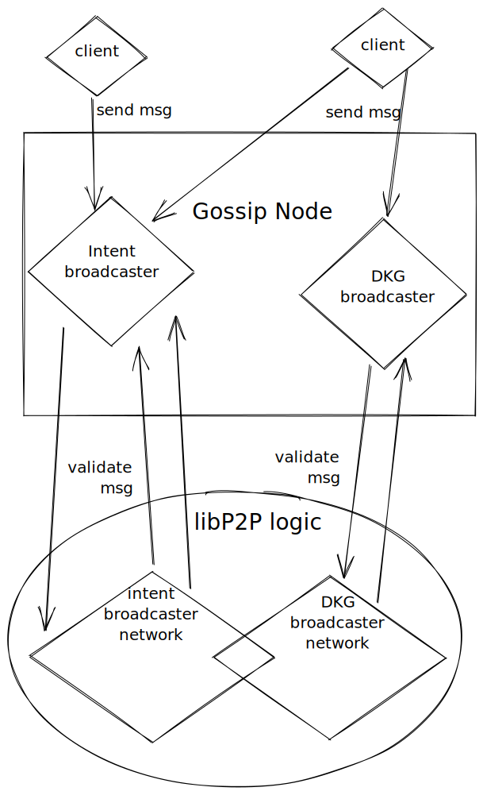

# The gossip network

The gossip network runs in parallel to the ledger network and is used to
propagate off-chain information. The network is based on
[libp2p](https://libp2p.io/) , a peer to peer network system that is implemented
in different languages, has a large user base and an active development.  It
allows us to readily implement a network to run our application.

The gossip network is used to propagate messages of two different applications,
intents for the [intent gossip system](intent_gossip/intent_gossip.md), and message for distributed keys
generation application.

## Flow diagram: High level overview

[Diagram on Excalidraw](https://excalidraw.com/#room=5d4a2a84ef52cf5f5f96,r4ghl40frJ9putMy-0vyOQ)
