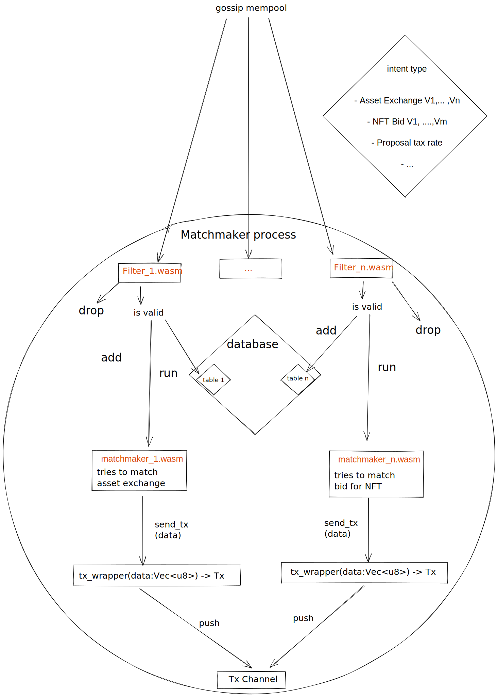

# Matchmaker

The matchmaker is a specific actor in the intent gossip network that tries to
match intents together. When intents are matched together, the matchmaker crafts
a transaction from them and sends it to the ledger network.

A matchmaker is an intent gossip node started with additional parameters: a
ledger address and a list of sub-matchmakers. A sub-matchmaker is defined with a
topics list, a main program path, a filter program path, and a transaction code.

The main and filter programs are wasm compiled code. Each has a defined
entrypoint and their own set of environment functions that they can call.

When the matchmaker receives a new intent from the network it calls the
corresponding sub-matchmaker, the one that has the intent’s topic in their
topics list. A sub-matchmaker first checks if the intent is accepted by the
filter, before adding it to that sub-matchmaker database. Then the main program
is called with the intent and current state.

## Sub-matchmaker topics' list

A sub-matchmaker is defined to work with only a subset of encoding. Each intent
propagated to the corresponding topic will be process by this sub-matchmaker.

Having a topics list instead of a unique topic allows a matchmaker to match
intents from different encodings. For example, when an updated version of an
encoding is out, the matchmaker could match intents from both versions if they
don’t diverge too much.

## Sub-matchmaker database and state (name TBD)

Each sub-matchmaker has a database and an arbitrary state.

The database contains intents received by the node from the topics list that
passed the filter.

The state is arbitrary data that is managed by the main program. That state is
given to all calls in the main program.

The database is persistent but the state is not. When a node is started the
state is recovered by giving all intents from the database to the main program.
The invariant that the current state is equal to the state if the node is
restarted is not enforced and is the responsibility of the main program.

## Filter program

The filter is an optional wasm program given in parameters. This filter is used
to check each intent received by that sub-matchmaker. If it's not defined,
intents are directly passed to the main program.

 The entrypoint `filter_intent` takes an intent and returns a boolean. The
filter has the ability to query the state of the ledger for any given key.

## Main program

The main program is a mandatory wasm program given in parameters. The main
program must match together intents.

The main program entrypoint `match_intent` takes the current state, a new intent
data and its id. The main program also has the ability to query the state of the
ledger. It also has functions `remove` and `get` to interact with the matchmaker
mempool. When a main matchmaker program finds a match it sends a transaction to
the ledger composed of the code template given in the matchmaker parameter and
the data given to this function. Finally the matchmaker must update its state so
the next run will have up to date values.

The main program is called on two specific occasion; when intent gossip node is
started, on all intent from database and whenever a new intent is received from
the p2p network and the RPC endpoint, if enabled.

## Transaction

The transaction code given in parameters is used when the main program matches a
group of intents. The main program returns arbitrary data that is attached to
the transaction which is then injected into a ledger node.

## Flow diagram: Matchmaker process

[excalidraw link](https://excalidraw.com/#room=92b291c13cfab8fb22a4,OvHfWIrL0jeDzPI-EFZMaw)
