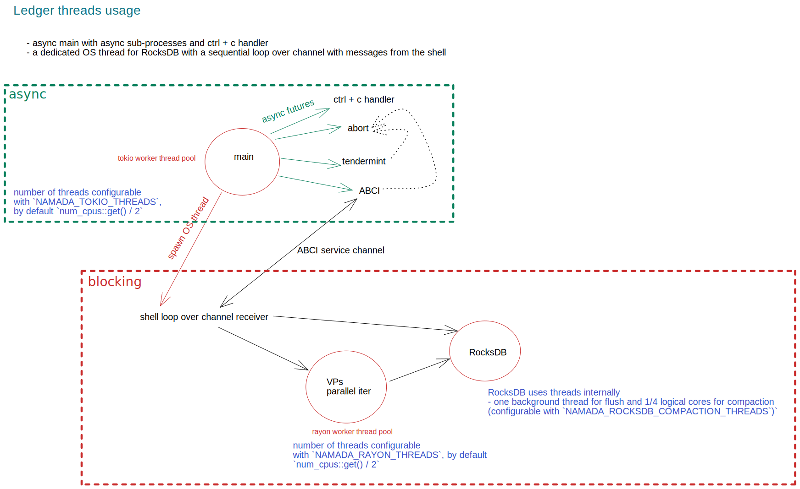
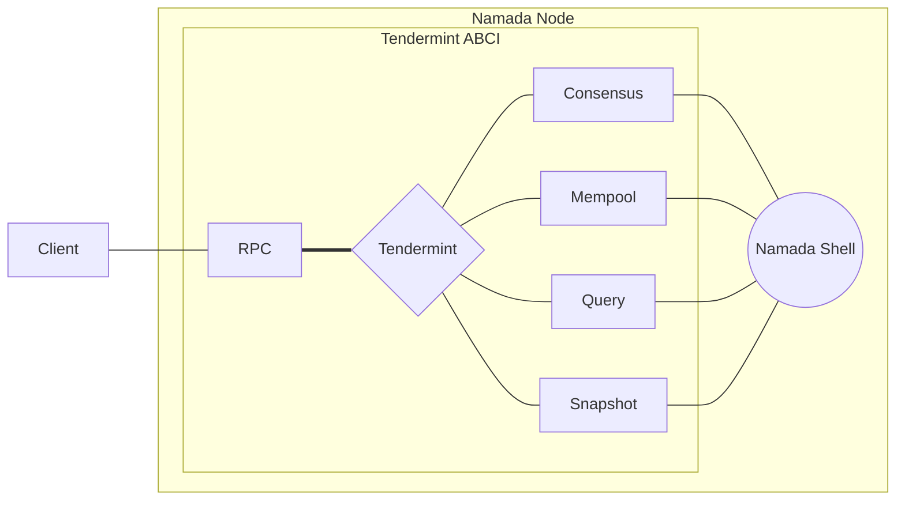

# The ledger

The ledger depends on [Tendermint node](https://github.com/tendermint/tendermint). Running the Namada node will also initialize and run Tendermint node. Namada communicates with Tendermint via the ABCI.

## Overview

The following diagram illustrates the current boundaries between the async and blocking code.

[Diagram on Excalidraw](https://excalidraw.com/#room=952eca1f17ac3c7b5cee,ReXYfqLLleTjVnSQM9zrjw)

## Threads config

Configuration for threads usage can be changed via environment variables:

- `NAMADA_TOKIO_THREADS`: Defaults to 1/2 logical cores
- `NAMADA_RAYON_THREADS`: Defaults to 1/2 logical cores.
- `NAMADA_ROCKSDB_COMPACTION_THREADS`: Defaults to 1/4 logical core. RocksDB also uses 1 more background thread for flushing.

## Tendermint ABCI

We are using the Tendermint state-machine replication engine via ABCI. It provides many useful things, such as a BFT consensus protocol, P2P layer with peer exchange, block sync and mempool layer.

Useful resources:

- Tendermint ABCI <https://docs.tendermint.com/master/spec/abci/>
- Tendermint RPC reference <https://docs.tendermint.com/master/rpc/>
- Awesome collection <https://github.com/tendermint/awesome>

Rust ABCI implementations:

- <https://github.com/informalsystems/tendermint-rs>
  - the future update planned for this crate is to add async support
  - longer term the goal is to be able to [seamlessly switch from Go Tendermint
    to Rust Tendermint](https://github.com/informalsystems/tendermint-rs/issues/29#issuecomment-672444401)
  - includes RPC and light-client libraries
- <https://github.com/devashishdxt/abci-rs>
  - async support
- <https://github.com/tendermint/rust-abci>
  - deprecated in favor of informalsystems/tendermint-rs

### ABCI Integration

The ledger wraps the Tendermint node inside the Namada node. The Tendermint node
communicates with the Namada shell via four layers as illustrated below.

The *consensus* connection allows the shell to:

- initialize genesis on start-up
- begin a block
- apply a transaction(s) in a block
- end a block
- commit a block

The *mempool* connection asks the shell to validate transactions before they get
stored in the mempool and broadcasted to peers. The mempool will signify that
the transaction is either new, when it has not been validated before, or to be
re-checked when it has been validated at some previous level.

The *query* connection is used for:

- the Tendermint node asks the last known state from the shell to determine if it needs to replay any blocks
- relay client queries for some state at a given path to the shell

The *snapshot* connection is used to serve state sync snapshots for other nodes and/or restore state sync snapshots to a local node being bootstrapped.
