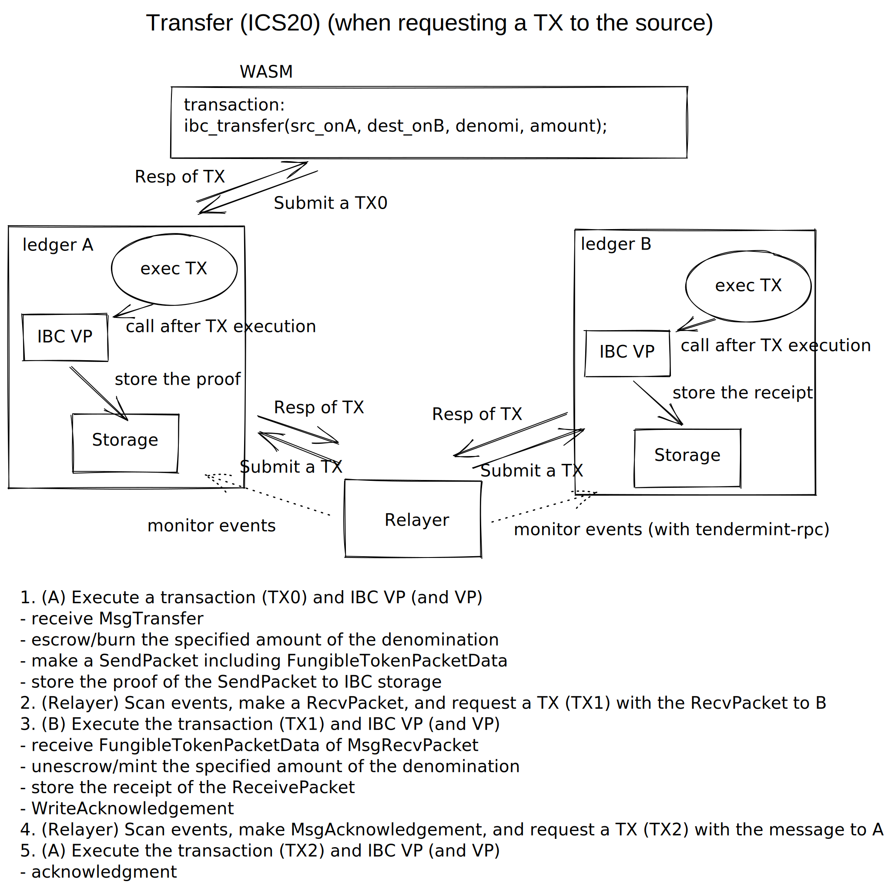

# IBC integration

[IBC](https://arxiv.org/pdf/2006.15918.pdf) allows a ledger to track another ledger's consensus state using a light client. IBC is a protocol to agree the consensus state and to send/receive packets between ledgers.

We have mainly two components for IBC integration, IBC handler and IBC validity predicate. IBC handler is a set of functions to handle IBC-related data. A transaction calls these functions for IBC operations. IBC validity predicate is a native validity predicate to validate the transaction which mutates IBC-related data.

## Storage key of IBC-related data
Its storage key should be prefixed with [`InternalAddress::Ibc`](https://github.com/anoma/namada/blob/e3c2bd0b463b35d66fcc6d2643fd0e6509e03d99/core/src/types/address.rs#L446) to differ them from other storage operations. A path after the prefix specifies an IBC-related data. The paths are defined by [ICS 24](https://github.com/cosmos/ibc/blob/master/spec/core/ics-024-host-requirements/README.md#path-space). The utility functions for the keys are defined [here](https://github.com/anoma/namada/blob/e3c2bd0b463b35d66fcc6d2643fd0e6509e03d99/core/src/ledger/ibc/storage.rs). For example, a client state of a counterparty ledger will be stored with a storage key `#IBC_encoded_addr/clients/{client_id}/clientState`. The IBC transaction and IBC validity predicate can use the storage keys to read/write IBC-related data according to IBC protocol.

## IBC transaction
A requester (IBC relayer or user) who wants to execute IBC operations on a ledger should make a transaction and an IBC message as transaction data, and submit a transaction with the transaction data. We provide [`tx_ibc.wasm`](https://github.com/anoma/namada/blob/e3c2bd0b463b35d66fcc6d2643fd0e6509e03d99/wasm/wasm_source/src/tx_ibc.rs) for IBC transaction.

The transaction can mutate the ledger state by writing not only data specified in the transaction but also IBC-related data on the storage sub-space. It depends on the given IBC message. The [`dispatch`](https://github.com/anoma/namada/blob/e3c2bd0b463b35d66fcc6d2643fd0e6509e03d99/core/src/ledger/ibc/actions.rs#L180) function will check the message and call the corresponding IBC operations. Also, it emits an IBC event at the end of the transaction.

### Handle IBC operations
IBC transaction mutates the ledger state. We provides IBC operations, e.g. [`create_client`](https://github.com/anoma/namada/blob/e3c2bd0b463b35d66fcc6d2643fd0e6509e03d99/core/src/ledger/ibc/actions.rs#L233). Basically, they read IBC-related data, check and update them according to IBC protocol. For example, when it receives a message `MsgCreateAnyClient` to create a new client for the counterparty chain, the transaction increments the client counter, makes a new client ID and inserts the client type, the client state and the client consensus state, then emits an event with the client ID. The transaction accesses the storage through the host environment functions.

### Emit IBC event
The ledger should set an IBC event to `events` in the ABCI response to allow relayers to get the events.

[`TxResult`](https://github.com/anoma/namada/blob/e3c2bd0b463b35d66fcc6d2643fd0e6509e03d99/core/src/types/transaction/mod.rs#L45) can have `IbcEvent`. [`IbcEvent`](https://github.com/anoma/namada/blob/e3c2bd0b463b35d66fcc6d2643fd0e6509e03d99/core/src/types/ibc.rs#L11) should have the IBC event type and necessary data according to the IBC operation. A transaction sets `IbcEvent` on the write log as non-committed data with the host environment function [`tx_emit_ibc_event`](https://github.com/anoma/namada/blob/e3c2bd0b463b35d66fcc6d2643fd0e6509e03d99/shared/src/vm/host_env.rs#L986). When the block is finalized, [the event is given to the ABCI response](https://github.com/anoma/namada/blob/e3c2bd0b463b35d66fcc6d2643fd0e6509e03d99/apps/src/lib/node/ledger/shell/finalize_block.rs#L194).

IBC relayer can get these events by subscribing to the ledger with Tendermint RPC or getting the response after the relayer submits a transaction. It is parsed in the relayer by [`from_tx_response_event()`](https://github.com/informalsystems/ibc-rs/blob/26087d575c620d1ec57b3343d1aaf5afd1db72d5/modules/src/events.rs#L167-L181).

## IBC validity predicate
IBC validity predicate is invoked after the transaction execution to validate the IBC operations. The trigger invoking IBC validity predicate is changing IBC-related data whose key is prefixed with `#IBC-encoded-addr`.

IBC validity predicate validates that the state changes by the IBC transaction are valid by checking the ledger state including prior and posterior. If the validation succeeds, the state changes are committed and the event is emitted. If the validation fails, the IBC-related mustations are dropped and the event isn't emitted. For the performance, IBC validity predicate is a [native validity predicate](vp.md#native-vps) that are built into the ledger.

IBC validity predicate has to execute the following validations for state changes of IBC-related data. `validate_tx` calls the corresponding validation functions according to the prefix of each storage key.

```rust
/* shared/src/ledger/ibc/vp/mod.rs */

/// IBC VP
pub struct Ibc<'a, DB, H, CA>
where
    DB: ledger_storage::DB + for<'iter> ledger_storage::DBIter<'iter>,
    H: StorageHasher,
    CA: 'static + WasmCacheAccess,
{
    /// Context to interact with the host structures.
    pub ctx: Ctx<'a, DB, H, CA>,
}

impl NativeVp for Ibc {

    fn validate_tx(
        &self,
        tx_data: &[u8],
        keys_changed: &BTreeSet<Key>,
        _verifiers: &BTreeSet<Address>,
    ) -> Result<bool> {
        for key in keys_changed {
            // Check the prefix of the storage key
            if let Some(ibc_prefix) = ibc_prefix(key) {
                match ibc_prefix {
                    IbcPrefix::Client => {
                        if is_client_counter_key(key) {
                            // Check if the counter is incremented
                        } else {
                            let client_id = get_client_id(key);
                            // client validation
                            self.validate_client(&client_id, tx_data)?
                        }
                    }
                    IbcPrefix::Connection => {
                        self.validate_connection(key, tx_data)?
                    }
                    IbcPrefix::Channel => {
                        self.validate_channel(key, tx_data)?
                    }
                    IbcPrefix::Port => self.validate_port(key)?,
                    IbcPrefix::Capability => self.validate_capability(key)?,
                    IbcPrefix::SeqSend => {
                        self.validate_sequence_send(key, tx_data)?
                    }
                    IbcPrefix::SeqRecv => {
                        self.validate_sequence_recv(key, tx_data)?
                    }
                    IbcPrefix::SeqAck => {
                        self.validate_sequence_ack(key, tx_data)?
                    }
                    IbcPrefix::Commitment => {
                        self.validate_commitment(key, tx_data)?
                    }
                    IbcPrefix::Receipt => {
                        self.validate_receipt(key, tx_data)?
                    }
                    IbcPrefix::Ack => self.validate_ack(key)?,
                    IbcPrefix::Event => {}
                    IbcPrefix::Unknown => {
                        return Err(Error::KeyError(format!(
                            "Invalid IBC-related key: {}",
                            key
                        )));
                    }
                }
            }
        }
        Ok(true)
    }
```

### Client validation
The IBC client is validated by checking the state change for updating or upgrading. `ibc-rs` provides the check functions for the updating and upgrading.

```rust
impl<'a, DB, H, CA> Ibc<'a, DB, H, CA>
where
    DB: 'static + storage::DB + for<'iter> storage::DBIter<'iter>,
    H: 'static + StorageHasher,
    CA: 'static + WasmCacheAccess,
{
    pub(super) fn validate_client(
        &self,
        client_id: &ClientId,
        tx_data: &[u8],
    ) -> Result<()> {
        // Check the client state change
        match self.get_client_state_change(client_id)? {
            StateChange::Created => {
                // "CreateClient"
                // Confirm that the corresponding consensus state exists
            }
            StateChange::Updated => {
                // check the message
                let ibc_msg = IbcMessage::decode(tx_data)?;
                match ibc_msg.0 {
                    Ics26Envelope::Ics2Msg(ClientMsg::UpdateClient(msg)) => {
                        // Check the header, the updated client state and consensus state
                        //   - Refer to `ibc-rs::ics02_client::client_def::check_header_and_update_state()`
                    }
                    Ics26Envelope::Ics2Msg(ClientMsg::UpgradeClient(msg)) => {
                        // Check the upgraded client state and consensus state
                        //   - Refer to `ibc-rs::ics02_client::client_def::verify_upgrade_and_update_state()`
                    }
                    _ => Err(Error::InvalidStateChange(format!(
                        "The state change of the client is invalid: ID {}",
                        client_id
                    ))),
                }

            }
            _ => Err(Error::InvalidStateChange(format!(
                "The state change of the client is invalid: ID {}",
                client_id
            ))),
        }
    }
}
```

### Connection validation
The IBC connection is validated by checking the state change for creating or updating in connection handshake. Some validations requires proof verification to verify the counterparty state. `ibc-rs` provides the proof verification function for the counterparty connection end.

```rust
impl<'a, DB, H, CA> Ibc<'a, DB, H, CA>
where
    DB: 'static + storage::DB + for<'iter> storage::DBIter<'iter>,
    H: 'static + StorageHasher,
    CA: 'static + WasmCacheAccess,
{
    pub(super) fn validate_connection(
        &self,
        key: &Key,
        tx_data: &[u8],
    ) -> Result<()> {
        if is_connection_counter_key(key) {
            // Check if the counter is incremented
            return Ok(());
        }

        // Check if the connection end exists
        let conn_id = connection_id(key)?;
        let conn = self.connection_end(&conn_id).map_err(|_| {
            Error::InvalidConnection(format!(
                "The connection doesn't exist: ID {}",
                conn_id
            ))
        })?;

        // Check the state change
        match self.get_connection_state_change(&conn_id)? {
            StateChange::Created => {
                match conn.state() {
                    State::Init => {
                        // "ConnectionOpenInit"
                        // Confirm that the corresponding client exists
                    }
                    State::TryOpen => {
                        // "ConnectionOpenTry"
                        // Confirm that the version is compatible

                        // Verify the proofs to check if the counterparty connection end exists as expected
                        //   - Use `ibc-rs::ics03_connection::handler::verify::verify_proofs()`
                    }
                }
            }
            StateChange::Updated => {
                if conn.state() != State::Open {
                    return Err(Error::InvalidConnection(format!(
                        "The state of the connection is invalid: ID {}",
                        conn_id
                    )));
                }
                // Check the previous state of the connection end
                let prev_conn = self.connection_end_pre(conn_id)?;
                match prev_conn.state() {
                    State::Init => {
                        // "ConnectionOpenAck"
                        // Verify the proofs to check if the counterparty connection end exists as expected
                        //   - Use `ibc-rs::ics03_connection::handler::verify::verify_proofs()`
                    }
                    State::TryOpen => {
                        // "ConnectionOpenConfirm"
                        // Verify the proofs to check if the counterparty connection end exists as expected
                        //   - Use `ibc-rs::ics03_connection::handler::verify::verify_proofs()`
                    }
                }
            }
            _ => Err(Error::InvalidStateChange(format!(
                "The state change of the connection is invalid: ID {}",
                conn_id
            ))),
        }
    }
}
```

### Port/Channel validation
The IBC port and channel end are validated by checking the state change for creating or updating in channel handshake as the connection validation. The validation function also checks the state change when the channel end is closed unlike a connection end. When packet timeout, the validation has to confirm that the commitment has been deleted. This deletion will trigger the packet validation for the timed-out packet.

```rust
impl<'a, DB, H, CA> Ibc<'a, DB, H, CA>
where
    DB: 'static + ledger_storage::DB + for<'iter> ledger_storage::DBIter<'iter>,
    H: 'static + StorageHasher,
    CA: 'static + WasmCacheAccess,
{
    pub(super) fn validate_port(&self, key: &Key) -> Result<()> {
        let port_id = port_id(key)?;
        match self.get_port_state_change(&port_id)? {
            StateChange::Created => {
                // Confirm that the port is owend
            }
            StateChange::Updated => {
                // Check the port is bound to another channel or released properly
            }
            _ => Err(Error::InvalidPort(format!(
                "The state change of the port is invalid: Port {}",
                port_id
            ))),
        }
    }
}
```

```rust
impl<'a, DB, H, CA> Ibc<'a, DB, H, CA>
where
    DB: 'static + ledger_storage::DB + for<'iter> ledger_storage::DBIter<'iter>,
    H: 'static + StorageHasher,
    CA: 'static + WasmCacheAccess,
{
    pub(super) fn validate_channel(
        &self,
        key: &Key,
        tx_data: &[u8],
    ) -> Result<()> {
        if is_channel_counter_key(key) {
            // Check if the counter is incremented
            return Ok(());
        }

        // Confirm that the port is owend
        // Confirm that the version is compatible

        // Check the channel state change
        match self.get_channel_state_change(&port_channel_id)? {
            StateChange::Created => match channel.state() {
                State::Init => {
                    // "ChannelOpenInit"
                }
                State::TryOpen => {
                    // "ChannelOpenTry"
                    // Verify the proof to check if the counterparty channel end exists as expected
                    //   - Use `ibc-rs::ics04_connection::handler::verify::verify_channel_proofs()`
                }
                _ => Err(Error::InvalidChannel(format!(
                    "The channel state is invalid: Port/Channel {}, State {}",
                    port_channel_id,
                    channel.state()
                ))),
            },
            StateChange::Updated => {
                let prev_channel = self.channel_end_pre(port_channel_id)?;
                match channel.state() {
                    State::Open => match prev_channel.state() {
                        State::Init => {
                            // "ChannelOpenAck"
                            // Verify the proof to check if the counterparty channel end exists as expected
                            //   - Use `ibc-rs::ics04_connection::handler::verify::verify_channel_proofs()`
                        }
                        State::TryOpen => {
                            // "ChannelOpenConfirm"
                            // Verify the proof to check if the counterparty channel end exists as expected
                            //   - Use `ibc-rs::ics04_connection::handler::verify::verify_channel_proofs()`
                        }
                    }
                    State::Closed => {
                        // Confirm that the previous state is State::Open

                        // Check the message
                        let ibc_msg = IbcMessage::decode(tx_data)?;
                        match ibc_msg.0 {
                            Ics26Envelope::Ics4PacketMsg(PacketMsg::ToPacket(msg)) => {
                                // "TimeoutPacket"
                                // Confirm that the commitment has been deleted
                                //    - The state change of the commitment triggers the packet validation
                            }
                            Ics26Envelope::Ics4PacketMsg(PacketMsg::ToClosePacket(
                                msg,
                            )) => {
                                // "TimeoutOnClosePacket"
                                // Confirm that the commitment has been deleted
                                //    - The state change of the commitment triggers the packet validation
                            }
                            Ics26Envelope::Ics4ChannelMsg(
                                ChannelMsg::ChannelCloseInit(msg),
                            ) => {
                                // "ChannelCloseInit"
                            }
                            Ics26Envelope::Ics4ChannelMsg(
                                ChannelMsg::ChannelCloseConfirm(msg),
                            ) => {
                                // "ChannelCloseConfirm"
                                // Verify the proof to check if the counterparty channel end exists as expected
                                //   - Use `ibc-rs::ics04_connection::handler::verify::verify_channel_proofs()`
                            }
                            _ => Err(Error::InvalidMessage(format!(
                                "The state change of the channel is invalid for the message: \
                                 Port/Channel {}",
                                port_channel_id,
                            ))),
                        }
                    }
                }
            }
            _ => Err(Error::InvalidStateChange(format!(
                "The state change of the channel: Port/Channel {}",
                port_channel_id
            ))),
        }
    }
}
```

### Sequence validation
When the packet sending, receiving, or acknowledgement, the sequence counter is incremented. The sequence validation checks these sequences and the existence of the commitment, the receipt, or acknowledgement. The contents of them are validated in the packet validation functions.

```rust
impl<'a, DB, H, CA> Ibc<'a, DB, H, CA>
where
    DB: 'static + ledger_storage::DB + for<'iter> ledger_storage::DBIter<'iter>,
    H: 'static + StorageHasher,
    CA: 'static + WasmCacheAccess,
{
    pub(super) fn validate_sequence_send(
        &self,
        key: &Key,
        tx_data: &[u8],
    ) -> Result<()> {
        // Confirm that the sequence is incremented
        // Confirm that the commitment exists
    }

    pub(super) fn validate_sequence_recv(
        &self,
        key: &Key,
        tx_data: &[u8],
    ) -> Result<()> {
        // Confirm that the sequence is incremented
        // Confirm that the receipt and the acknowledgement exist
    }

    pub(super) fn validate_sequence_ack(
        &self,
        key: &Key,
        tx_data: &[u8],
    ) -> Result<()> {
        // Confirm that the sequence is incremented
        // Confirm that the commitment doesn't exist
    }
}
```

### Packet validation
The validation functions should check commitment, receipt, and acknowledgement which are stored or deleted when packet sending, receiving or acknowledgement. And, when the commitment has been deleted, the packet timeout should be checked.

```rust
impl<'a, DB, H, CA> Ibc<'a, DB, H, CA>
where
    DB: 'static + storage::DB + for<'iter> storage::DBIter<'iter>,
    H: 'static + StorageHasher,
    CA: 'static + WasmCacheAccess,
{
    pub(super) fn validate_commitment(
        &self,
        key: &Key,
        tx_data: &[u8],
    ) -> Result<()> {
        // check if the commitment is stored or deleted
        match self
            .get_state_change(key)
            .map_err(|e| Error::InvalidStateChange(e.to_string()))?
        {
            StateChange::Created => {
                // "SendPacket"
                // Confirm that the channel is open
                // Validate the sent packet
                // Confirm that the expected commitment exists
            }
            StateChange::Deleted => {
                let ibc_msg = IbcMessage::decode(tx_data)?;
                match channel.state() {
                    State::Open => {
                        match &ibc_msg.0 {
                            Ics26Envelope::Ics4PacketMsg(
                                PacketMsg::AckPacket(msg),
                            ) => {
                                // "PacketAcknowledgement"
                                // Verify the proof to check if the expected ack exists on the counterparty
                            }
                            Ics26Envelope::Ics4PacketMsg(
                                PacketMsg::ToPacket(_),
                            )
                            | Ics26Envelope::Ics4PacketMsg(
                                PacketMsg::ToClosePacket(_),
                            ) => {
                                // "PacketTimeout"
                                // Confirm that the deleted commitment was for the channel and the counterparty
                                if !is_timed_out(packet) {
                                    // "PacketTimedoutOnClose"
                                    // Verify the proof to check if the counterparty channel is closed
                                }
                            }
                            _ => Err(Error::InvalidChannel(format!(
                                "The channel state is invalid: Port {}, \
                                 Channel {}",
                                commitment_key.0, commitment_key.1
                            ))),
                        }
                    }
                    State::Closed => {
                        // "PacketTimeout"
                        // Confirm that the deleted commitment was for the channel and the counterparty
                        // Confirm that the packet timed out
                    }
                    _ => Err(Error::InvalidChannel(format!(
                        "The channel state is invalid: Port {}, Channel {}",
                        commitment_key.0, commitment_key.1
                    ))),
                }
            }
            _ => Err(Error::InvalidStateChange(format!(
                "The state change of the commitment is invalid: Key {}",
                key
            ))),
        }

            }
        }
    }

    pub(super) fn validate_receipt(
        &self,
        key: &Key,
        tx_data: &[u8],
    ) -> Result<()> {
        // Check the state change of the receipt
        match self
            .get_state_change(key)
            .map_err(|e| Error::InvalidStateChange(e.to_string()))?
        {
            StateChange::Created => {
                OK(())
            }
            _ => Err(Error::InvalidStateChange(
                "The state change of the receipt is invalid".to_owned(),
            )),
        }
    }

    pub(super) fn validate_ack(&self, key: &Key) -> Result<()> {
        match self
            .get_state_change(key)
            .map_err(|e| Error::InvalidStateChange(e.to_string()))?
        {
            StateChange::Created => {
                // Confirm that the receipt exists
            }
            _ => Err(Error::InvalidStateChange(
                "The state change of the acknowledgment is invalid".to_owned(),
            )),
        }
    }
}
```

### Proof
A query for a proven IBC-related data returns the value and the proof. The proof is used to verify if the key-value pair exists or doesn't exist on the counterpart ledger in IBC validity predicate (ICS 23).

The query response has the proof as [`tendermint::merkle::proof::Proof`](https://github.com/informalsystems/tendermint-rs/blob/dd371372da58921efe1b48a4dd24a2597225df11/tendermint/src/merkle/proof.rs#L15), which consists of a vector of [`tendermint::merkle::proof::ProofOp`](https://github.com/informalsystems/tendermint-rs/blob/dd371372da58921efe1b48a4dd24a2597225df11/tendermint/src/merkle/proof.rs#L25). `ProofOp` should have `data`, which is encoded to `Vec<u8>` from [`ibc_proto::ics23::CommitmentProof`](https://github.com/informalsystems/ibc-rs/blob/66049e29a3f5a0c9258d228b9a6c21704e7e2fa4/proto/src/prost/ics23.rs#L49). The relayer getting the proof converts the proof from `tendermint::merkle::proof::Proof` to `ibc::ics23_commitment::commitment::CommitmentProofBytes` by [`convert_tm_to_ics_merkle_proof()`](https://github.com/informalsystems/ibc-rs/blob/66049e29a3f5a0c9258d228b9a6c21704e7e2fa4/modules/src/ics23_commitment/merkle.rs#L84) and sets it to the request data of the following IBC operation.

## Relayer (ICS 18)
IBC relayer monitors the ledger, gets the status, state and proofs on the ledger, and requests transactions to the ledger via Tendermint RPC according to IBC protocol. For relayers, the ledger has to make a packet, emits an IBC event and stores proofs if needed. And, a relayer has to support Namada ledger to query and validate the ledger state. It means that `ChainEndpoint` in IBC Relayer of [ibc-rs](https://github.com/informalsystems/ibc-rs) should be implemented for Anoma like [that of CosmosSDK](https://github.com/informalsystems/ibc-rs/blob/66049e29a3f5a0c9258d228b9a6c21704e7e2fa4/relayer/src/chain/cosmos.rs). As those of Cosmos, these queries can request ABCI queries to Namada.

```rust
impl ChainEndpoint for Namada {
    ...
}
```

## Token Transfer (ICS 20)
### IBC Token VP
IBC token VP checks a transfer of a sent/received/refunded token over IBC. These transfers change the state of accounts sub-prefixed with [`IbcToken` including a hash or the owner address is `IbcEscrow`, `IbcBurn`, `IbcMint`](https://github.com/anoma/namada/blob/e3c2bd0b463b35d66fcc6d2643fd0e6509e03d99/core/src/types/address.rs#L446), i.e. this VP is triggered by the state change of these accounts.

The existing token's VP `vp_token` checks if the total of the changes in the transaction should be zero. IBC-related accounts should be included as general accounts.
IBC token VP as a native VP should check if the escrow/unescrow/burn/mint has been done properly in the transaction. When an IBC transaction has `MsgTransfer`, the VP should check if the amount of the specified token by the message has been escrowed or burned. When an IBC transaction has `MsgRecvPacket` with `FungibleTokenPacketData`, the VP should check if the amount of the specified token by the data has been unescrowed or minted. For example, if a transaction tries to unescrow an amount and to send it to a different account from the specified account, the VP should refuse it, even if the transaction satisfies IBC protocol.

### Send a token
In a transaction with `MsgTransfer` (defined in ibc-rs) including `FungibleTokenPacketData` as transaction data, the specified token is sent according to ICS20 and a packet is sent.
The transaction updates the sender's balance by escrowing or burning the amount of the token. The account, the sent token(denomination), and the amount are specified by `MsgTransfer`. [The denomination field would indicate that this chain is the source zone or the sink zone](https://github.com/cosmos/ibc/blob/master/spec/app/ics-020-fungible-token-transfer/README.md#technical-specification).

#### Sender
Basically, the sender key is `{token_addr}/balance/{sender_addr}`. `{token_addr}` and `{sender_addr}` is specified by `FungibleTokenPacketData`. When the denomination `{denom}` in `FungibleTokenPacketData` specifies the source chain, the transfer operation is executed from the origin-specific account `{token_addr}/ibc/{ibc_token_hash}/balance/{sender_addr}` (Ref. [Receiver](#Receiver)). We can set `{token_addr}`, `{port_id}/{channel_id}/../{token_addr}`, or `ibc/{ibc_token_hash}/{token_addr}` to the denomination. When `ibc/{ibc_token_hash}/` is prefixed, the transfer looks up the prefixed denomination `{port_id}/{channel_id}/{denom}` by the `{ibc_token_hash}`. `{denom}` might have more prefixes to specify the source chains, e.g. `{port_id_b}/{channel_id_b}/{port_id_a}/{channel_id_a}/{token_addr}`. According to the prefixed port ID and channel ID, the transfer operation escrows or burns the amount of the token (ICS20).

#### Escrow
When this chain is the source zone, i.e. the denomination does NOT start with the port ID and the channel ID of this chain, the amount of the specified token is sent from the sender's account key to the escrow key `{token_addr}/ibc/{port_id}/{channel_id}/balance/IbcEscrow`. The escrow address should be associated with IBC port ID and channel ID to unescrow it later. The escrow address is one of internal addresses, `InternalAddress::IbcEscrow`. It is not allowed to transfer from the escrow account without IBC token transfer operation. IBC token VP should check the transfer from the escrow accounts.

#### Burn
When the destination chain was the source, i.e. the denomination starts with the port ID and the channel ID of this chain, the amount of the specified token is sent from the sender's account to a key `{token_addr}/ibc/{port_id}/{channel_id}/balance/IbcBurn`. `IbcBurn` is one of internal addresses, `InternalAddress::IbcBurn`. The value of the key should NOT written to the block when the block is committed, i.e. reading the previous value of the key in a VP results in always `None` and the balance is zero by default. We can use `tx_write_temp` in the transaction for these writes.

### Receive a token
In a transaction with `MsgRecvPacket` (defined in ibc-rs) including `FungibleTokenTransferData` as transaction data, the specified token is received according to ICS20.
The transaction updates the receiver's balance by unescrowing or minting the amount of the token. The account(receiver), the received token(denomination), and the amount are specified by `FungibleTokenPacketData` in the received packet.

#### Receiver
The receiver's account key should be origin-specific because the token should be returned to the source chain if needed. The key is `{token_addr}/ibc/{ibc_token_hash}/balance/{receiver_addr}`. `{ibc_token_hash}` is calculated from the denomination prefixed with this chain's port ID and chain ID, and the token address. And, the original denomination should be persistent with the storage key `#IBC_encoded_addr/denom/{ibc_token_hash}` for looking it up when sending the received token.

#### Unescrow
When this chain was the source zone, i.e. the denomination starts with this chain's port ID and channel ID, the amount of the token is sent from its escrow key `{token_addr}/ibc/{port_id}/{channel_id}/balance/IbcEscrow`.

#### Mint
When this chain is not the source zone, i.e. the denomination does NOT start with this chain's port ID and channel ID, the amount of the token is minted from the mint account `{token_addr}/ibc/{port_id}/{channel_id}/balance/IbcMint`. The `IbcMint` is one of internal addresses, `InternalAddress::IbcMint`. The account is NOT updated when the block is committed same as `IbcBurn`, i.e. reading the previous value of the mint account in a VP results in always the maximum amount.

### Refund tokens
When a packet has timed out or a failure acknowledgement is given, the escrowed or burned amount of the token should be refunded by unescrowing or minting the amount of the token on the chain which has sent the token. i.e. the IBC transaction should transfer the amount of the token from `{token_addr}/ibc/{port_id}/{channel_id}/balance/IbcEscrow` or `{token_addr}/ibc/{port_id}/{channel_id}/balance/IbcMint` to the sender account.


