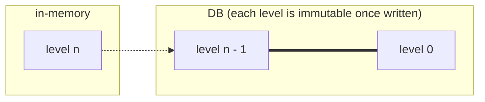
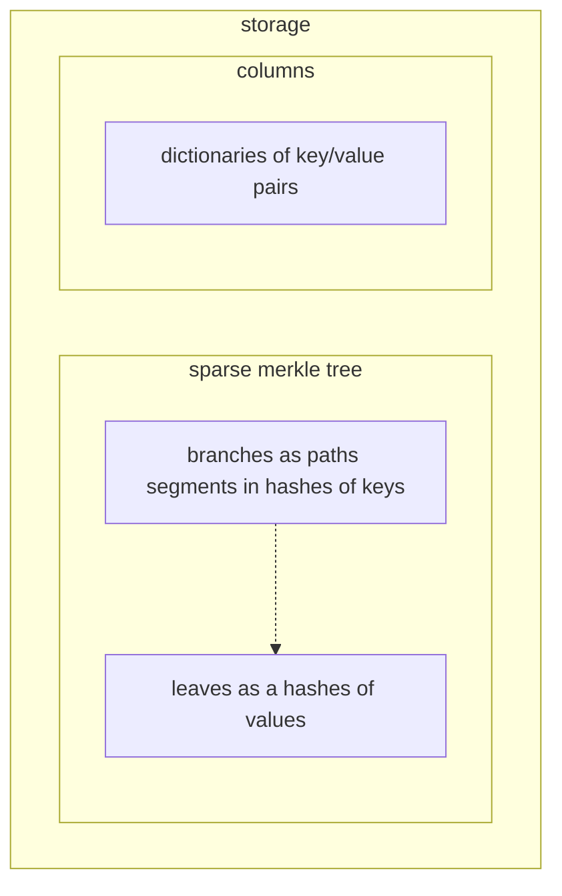
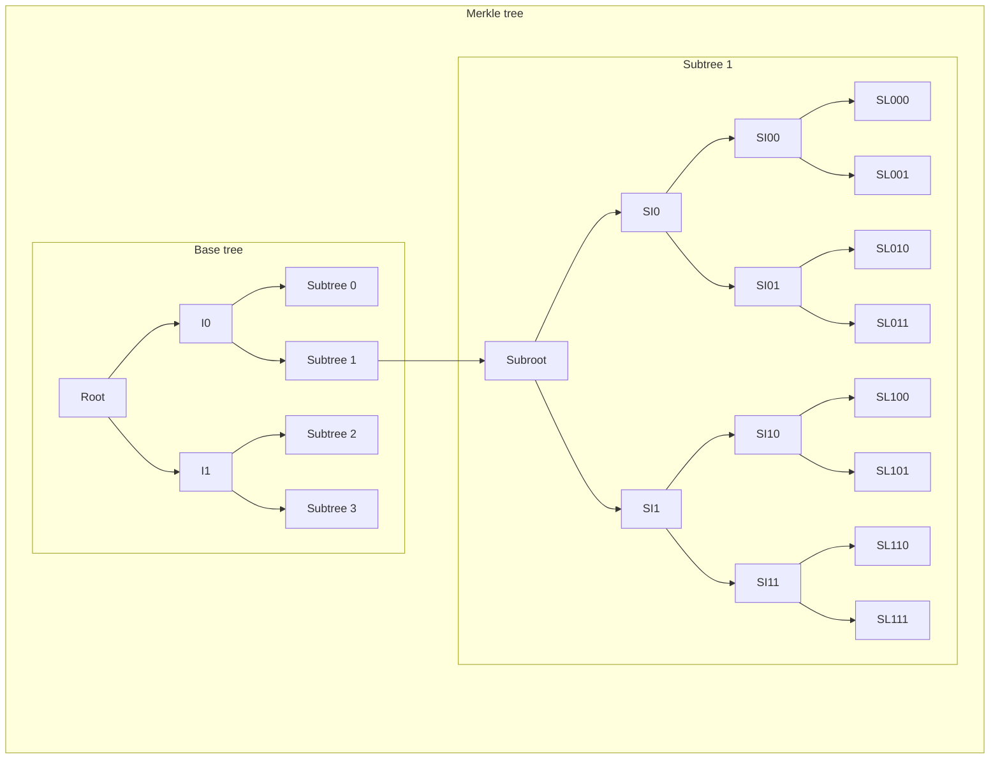

# Storage

By default, we persist all the historical data for the predecessor blocks to be able to replay the whole chain and to be able to support Tendermint's rollback command (that allows to rollback the state to the predecessor block, which is useful recovering from a corrupt state). For values that change on every block, we can simply prefix their storage key with the block height.

However, for the accounts storage it is reasonable to expect that in each block only a small subset of the data will be updated, so we can avoid persisting values that haven't changed from the predecessor block. To achieve that:

- The latest value is written into and read from its storage key without any height prefix
- If the previous value is overwritten or deleted at block height `n`, we store the diff (old and new value) under `n` prefix (the height at which it's been changed from this value)

Note that when there are multiple updates of a value with the same storage key in the same block, only the last value will be persisted to the block.

The block's mutable metadata is permanently in-memory and batch written to DB once a block is finalized.

The accounts storage data are written and read directly to/from the DB and the DB layer manages its cache.

## In-memory (mutable state)

The current state is stored in a Sparse Merkle tree. The layout of data in memory should be flexible to allow to optimize throughput. For example, the values of key/value pairs may better stored in a sequence outside of the tree structure. Furthermore, it maybe be better to have the data sorted in memory. This may be possible by decoupling the merkle tree structure from the data and the key/value pairs, as illustrated below.

It may be advantageous if the data columns keys are not hashed to preserve ordering.

## DB (immutable state)

The immutable state doesn't have the same requirements as the mutable. This means that a different data structures or memory layout may perform better (subject to benchmarks). The state trees in the immutable blocks should take advantage of its properties for optimization. For example, it can save storage space by sharing common data and/or delta compression.

It's very likely that different settings for immutable storage will be provided in future, similar to e.g. [Tezos history modes](https://tezos.gitlab.io/user/history_modes.html).

## Benchmarks

We'd like to have easily reproducible benchmarks for the whole database integration that should be filled over time with pre-generated realistic data. This should enable us to tune and compare different hashing functions, backends, data structures, memory layouts, etc.

### Criteria

- in-memory
  - writes (insert, update, delete)
    - possibly also concurrent writes, pending on the approach taken for concurrent transaction execution
  - reads
  - proof generation (inclusion, non-inclusion)
- DB (lower priority)
  - writes in batched mode
  - reads
  - proof generation (inclusion, non-inclusion)

## DB backends

The considered options for a DB backend are given in [Libraries & Tools / Database page](../../libraries/db.md).

### RocksDB

A committed block is not immediately persisted on RocksDB. When the block is committed, a set of key-value pairs which compose the block is written to the memtable on RocksDB. For the efficient sequential write, a flush is executed to persist the data on the memtable to the disk as a file when the size of the memtable is getting big (the threshold is one of the tuning parameters).

We can disable write-ahead log(WAL) which protects these data on the memtable from a crash by persisting the write logs to the disk. Disabling WAL helps reduce the write amplification. That's because WAL isn't required for Namada because other nodes have the block. The blocks which have not been persisted to the disk by flush can be recovered even if an Namada node crashes.

## Implementation

### `storage` module

This is the main interface for interacting with storage in Namada.

This module and its sub-modules should implement the in-memory storage (and/or a cache layer) with Merkle tree (however, the interface should be agnostic to the choice of vector commitment scheme or whether or not there even is one, we may want non-Merklised storage) and the persistent DB.

The in-memory storage holds chain's metadata and current block's storage.

Its public API should allow/provide:

- get the Merkle root and Merkle tree proofs
- read-only storage API for ledger's metadata to be accessible for transactions' code, VPs and the RPC
  - with public types of all the stored metadata
- unless specified otherwise, read the state from the current block

An API made visible only to the shell module (e.g. `pub ( in SimplePath )` - <https://doc.rust-lang.org/reference/visibility-and-privacy.html>) should allow the shell to:

- load state from DB for latest persisted block or initialize a new storage if none found
- begin a new block
- within a block:
  - transaction can modify [account sub-space](accounts.md#dynamic-storage-sub-space)
    - the function that modify storage (e.g. `write` and `delete`) have to guarantee to also update the Merkle tree
  - store each applied transaction and its result
- end the current block
- commit the current block (persist to storage)

### `storage/merkle_tree` module

It consists of one Sparse Merkle Tree (base tree) and multiple Sparse Merkle Trees (subtrees). The base tree stores the store type and the root of each subtree as a key-value pair. Each subtree has the hashed key-value pairs for each data.

The first segment of a [DB key](#db-keys) is used as a key in the base tree and the sub key (without the first segment) specifies the leaf of the subtree.

A proof of the key-value pair in the Merkle tree should be made of two proofs for the base tree and the subtree. Merkle root is the root of the base tree. In the proof verification, the sub root is calculated with the subtree's proof at first. Then, the root is calculated with the base tree's proof and the calculated sub root as a value, and the calculated root is compared with the Merkle root.

### `storage/db` module

The persistent DB implementation (e.g. RocksDB).

### DB keys

The DB keys are composed of key segments. A key segment can be an `Address` which starts with `#` (there can be multiple addresses involved in a key) or any user defined non-empty utf-8 string (maybe limited to only alphanumerical characters). Also, `/` and `?` are reserved. `/` is used as a separator for segments. `?` is reserved for a validity predicate and the key segment `?` can be specified only by the specific API.
