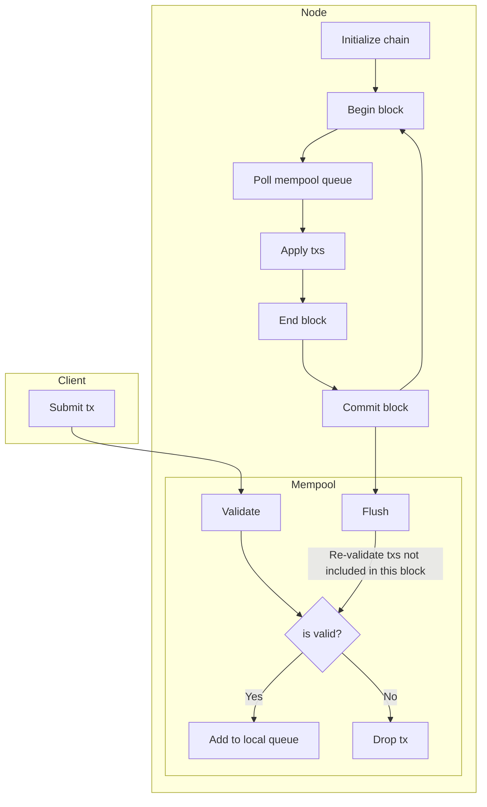
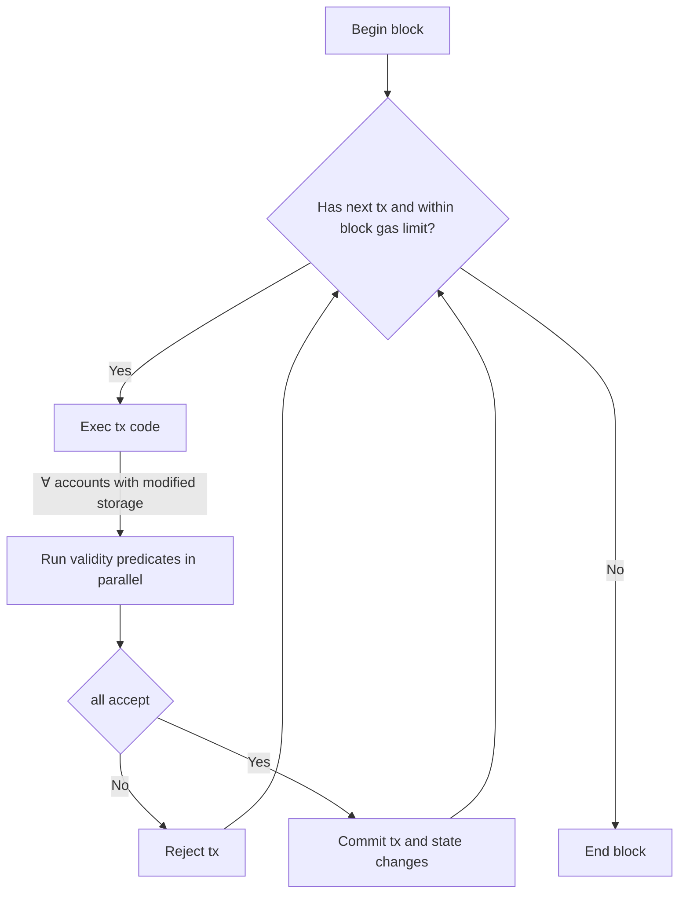

# Transactions

[Tracking Issue](https://github.com/anoma/namada/issues/43)

---

There is only a single general transaction (tx) type:

```rust
struct Transaction {
    // A wasm module with a required entrypoint
    code: Vec<u8>
    // Optional arbitrary data
    data: Option<Vec<u8>>,
    // A timestamp of when the transaction was created
    timestamp: Timestamp,
    gas_limit: TODO,
}
```

The tx allows to include arbitrary `data`, e.g zero-knowledge proofs and/or arbitrary nonce bytes to obfuscate the tx's minimum encoded size that may be used to derive some information about the tx.

TODO once we have DKG, we will probably want to have some kind of a wrapper transaction with submission fees, payer and signature

## Tx life cycle



New txs are injected by the client via mempool. Before including a tx in a local mempool queue, some cheap validation may be performed. Once a tx is included in a mempool queue, it will be gossiped with the peers and may be included in a block by the block proposer. Any txs that are left in the queue after flush will be subject to re-validation before being included again.

The order of applying transactions within a block is fixed by the block proposer in [the front-running prevention protocol](front-running.md).

TODO we might want to randomize the tx order after DKG protocol is completed

### Block application

Within a block, each tx is applied sequentially in three steps:



## Tx execution

The code is allowed to read and write anything from [accounts' sub-spaces](./accounts.md#dynamic-storage-sub-space) and to [initialize new accounts](./accounts.md#initializing-a-new-account). Other data that is not in an account's subspace is read-only, e.g. chain and block metadata, account addresses and potentially keys.

In addition to the verifiers specified in a transaction, each account whose sub-space has been modified by the tx triggers its VP.

For [internal addresses](accounts.md#internal-transparent-addresses), we invoke their module's native VP interface directly. For other addresses, we look-up validity predicates WASM to be executed from storage.

The VPs are then given the prior and posterior state from the account's sub-space together with the tx to decide if it accepts the tx's state modifications.

Within a single tx the execution of the validity predicates will be parallelized and thus the fee for VPs execution would their maximum value (plus some portion of the fees for each of the other parallelized VPs - nothing should be "free"). Once any of the VPs rejects the modifications, execution is aborted, the transaction is rejected and state changes discarded. If all the VPs accept the modifications, the transaction is successful and modifications are committed to storage as the input of the next tx.

The transaction's API should make it possible to transfer tokens to a hash of a public key that is not revealed. This could be done by having a "deposit" account from which the key's owner can claim the deposited funds.

Should some type of token prefer not to allow to receive tokens without recipient's approval, a token account can implement logic to decline the received tokens.

