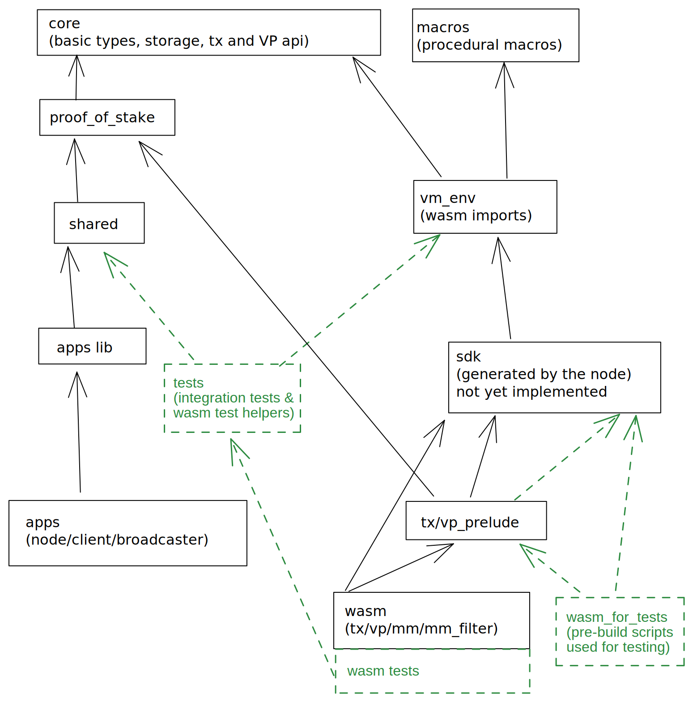
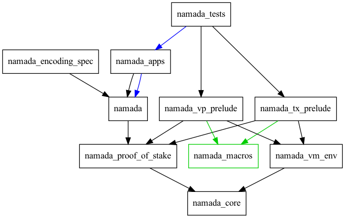

# Overview

> ⚠️ This section is WIP.

- TODO: add high-level interaction diagram(s)

The Rust crates internal dependency graph:


[Diagram on Excalidraw](https://excalidraw.com/#room=e32fc914de750ed4f5e4,6CWRFjnmCoiFR4BQ6i9K4g)

## Graph for root workspace



Generated with:

```shell
# Uses https://crates.io/crates/cargo-depgraph
# From root dir:
cargo depgraph --workspace-only --dedup-transitive-deps --dev-deps | dot -Tpng > documentation/dev/src/explore/design/root-workspace-cargo-udeps.png
```
