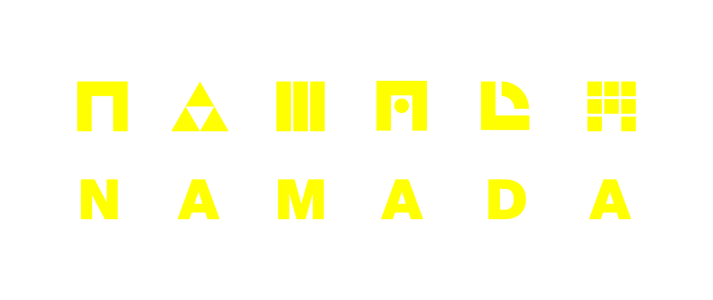

# Namada

## About Namada
* [Namada](https://namada.net/) is the first fractal instance of [Anoma](https://anoma.net)
* Namada is instantiated as a product for asset-agnostic, interchain privacy
* Namada is built by a public good laboratory called [Heliax](https://heliax.dev)

### Key innovations:

- Zcash-like transfers for any assets (fungible and non-fungible)
- Rewarded usage of privacy as a public good
- Interoperability with Ethereum via a custom bridge with trust-minimisation
- Vertically integrated user interfaces

## Overview of features
- Proof-of-Stake with governance to secure and evolve Namada
- Fast-finality BFT with 4-second blocks
- Near-zero fees
- Trustless 2-way Ethereum bridge via IBC implementation on ETH
- IBC bridges to chains that already speak IBC (all Cosmos chains)
- MASP
- Convert Circuit (shielded set rewards)
- A reference interface
- Ledger application

For high-level introductions, we recommend:

- Article: [Introducing Namada: Interchain Asset-agnostic Privacy](https://blog.namada.net/introducing-namada-interchain-asset-agnostic-privacy/)
- Article: [What is Namada?](https://blog.namada.net/what-is-namada/)
- [Talks & Podcasts](https://namada.net/talks)

To learn more about the protocol, we recommend the following in-depth resources:

- Talk at ZK8 [Namada: asset-agnostic interchain privacy](https://youtu.be/5K6YxmZPFkE)
- [Namada's specifications](https://specs.namada.net)
- [Codebase](https://github.com/anoma/namada)
