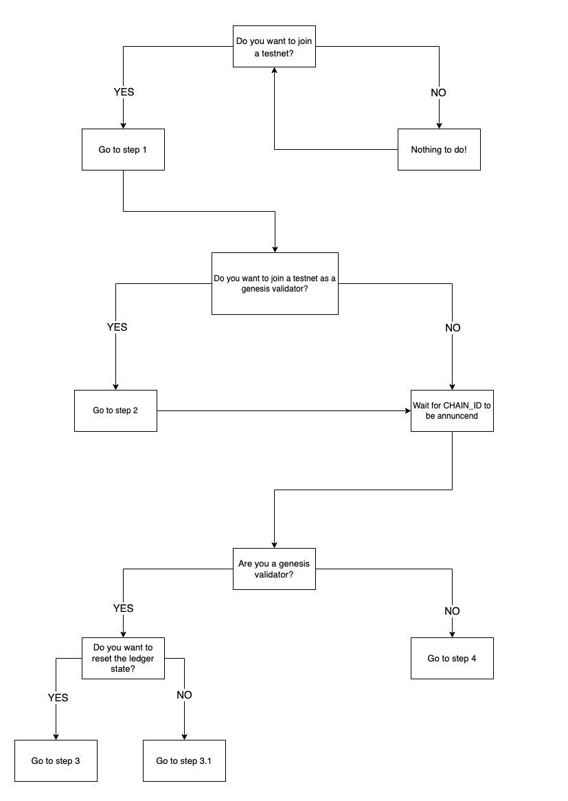

# Namada Testnets

For more context read:
- [Announcing Namada Public Testnets](https://blog.namada.net/announcing-namada-public-testnets/)

## Namada protocol versions

A testnet might deploy different versions of the Namada protocol. To see in-detail what each protocol version includes, refer to the [Github changelog](https://github.com/anoma/namada/tree/main/.changelog), which specifies what changes have been made in between versions.

## Report a bug

If you find a bug, please submit an issue with the `bug` [issue template](https://github.com/anoma/namada/issues/new/choose).

## How to join a Namada testnet
  1. [Environment setup](./environment-setup.md)
  2. [Pre-genesis validator](./pre-genesis-validator.md)
  3. [Running your genesis validator](./run-your-genesis-validator.md)
  4. [Running a full node](./running-a-full-node.md)
  5. [Becoming a validator post-genesis](./post-genesis-validator.md)

## Testnet versions
All public testnets will be listed here:
- Namada public testnet 1:
  - Namada protocol version: `v0.12.0`
  - Tendermint version: `v0.1.4-abciplus`
  - Genesis time: 20th of December 2022 at 17:00 UTC
  - CHAIN_ID: `public-testnet-1.0.05ab4adb9db`

## Block explorer
The block explorer is currently in development. The latest version can be found at [namada.world](https://namada.world/)

## Community
For questions or feedback, feel free to post or comment on [Reddit](https://www.reddit.com/r/namada) or [Github](https://github.com/anoma/namada/issues). Don't forget to [follow Namada](https://twitter.com/namadanetwork) on Twitter for testnet relevant updates.