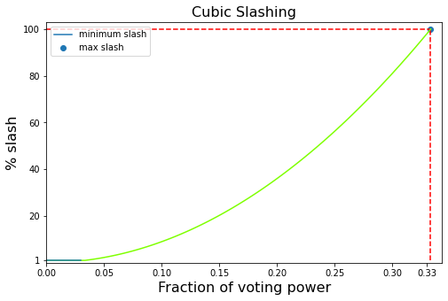

# Cubic slashing

Namada implements a slashing scheme that is called cubic slashing: the amount of a slash is proportional to the cube of the voting power committing infractions within a particular interval. This is designed to make it riskier to operate larger or similarly configured validators, and thus the scheme encourages network resilience.

When a slash is detected:
1. Using the height of the infraction, calculate the epoch at the unbonding length relative to the current epoch. This is the final epoch before the stake that was used to commit the infraction can be fully unbonded and withdrawn. The slash is enqueued to be processed in this final epoch to allow for sufficient time to detect any other validator misbehaviors while still processing the slash before the infraction stake could be unbonded and withdrawn. 
2. Jail the misbehaving validator, effective at the beginning of the next epoch. While the validator is jailed, it is removed from the validator set. Note that this is the only instance in our proof-of-stake model wherein the validator set is updated without waiting for the pipeline offset.
3. Prevent the delegators to this validator from altering their delegations in any way until the enqueued slash is processed.

At the end of each epoch, for each slash enqueued to be processed for the end of the epoch:
1. Collect all known infractions committed within a range of (-1, +1) epochs around the infraction in question.
2. Sum the fractional voting powers (relative to the total PoS voting power) of the misbehaving validator for each of the collected nearby infractions. 
3. The final slash rate for the slash in question is then dependent on this sum. Using $r_\text{nom}$ as the nominal slash rate and $\text{vp}$ to indicate voting power, the slash rate is expressed as:

$$  \max \{~r_{\text{nom}}~, ~9*\big(\sum_{i \in \text{infractions}}\frac{\text{vp}_i}{\text{vp}_{\text{tot}}}\big)^2~\}. $$

Or, in pseudocode:
<!-- I want to make these two code blocks toggleable as in  https://rdmd.readme.io/docs/code-blocks#tabbed-code-blocks but can't seem to get it to work-->
<!-- ```haskell =
calculateSlashRate :: [Slash] -> Float

calculateSlashRate slashes = 
    let votingPowerFraction = sum [ votingPowerFraction (validator slash) | slash <- slashes]
	in max 0.01 (min 1 (votingPowerFraction**2)*9)
  -- minimum slash rate is 1%
  -- then exponential between 0 & 1/3 voting power
  -- we can make this a more complex function later
``` -->

<!-- ```python
class PoS:
    def __init__(self, genesis_validators : list):
        self.update_validators(genesis_validators)
    
    def update_validators(self, new_validators):
        self.validators = new_validators
        self.total_voting_power = sum(validator.voting_power for validator in self.validators)
    
    def slash(self, slashed_validators : list):
        for slashed_validator in slashed_validators: 
            voting_power_fraction = slashed_validator.voting_power / self.total_voting_power
            slash_rate = calc_slash_rate(voting_power_fraction)
            slashed_validator.voting_power *= (1 - slash_rate)

    def get_voting_power(self):
        for i in range(min(10, len(self.validators))):
            print(self.validators[i])
    
    @staticmethod
    def calc_slash_rate(voting_power_fraction):
        slash_rate = max(0.01, (voting_power_fraction ** 2) * 9)
        return slash_rate
``` -->

```rust
// Infraction type, where inner field is the slash rate for the type
enum Infraction {
    DuplicateVote(f64),
    LightClientAttack(f64)
}

// Generic validator with an address and voting power
struct Validator {
    address: Vec<u8>,
    voting_power: u64,
}

// Generic slash object with the misbehaving validator, infraction type, and some unique identifier
struct Slash {
    validator: Validator,
    infraction_type: Infraction,
    id: u64,
}

// Calculate a vector of final slash rates for each slash in the current epoch
fn calculate_slash_rates(
    current_epoch: u64,
    nominal_slash_rate: f64,
    slashes: Map<u64, Vec<Slash>>,
    total_voting_power: u64
) -> Vec<f64> {
    let slashes_this_epoch = slashes.get(current_epoch);
    let slashes_prev_epoch = slashes.get(current_epoch - 1);
    let slashes_next_epoch = slashes.get(current_epoch + 1);

    let associated_slashes = slashes_prev_epoch.extend(slashes_this_epoch).extend(slashes_next_epoch);
    let final_rates: Vec<f64>;

    for slash in &slashes_this_epoch {
        let vp_frac_sum: f64 = 0;
        for assoc_slash in &associated_slashes {
            if assoc_slash.id == slash.id { continue; }
            vp_frac_sum += assoc_slash.validator.voting_power / total_voting_power;
        }
        let rate = max( slash.infraction_type.0 , 9 * vp_frac_sum * vp_frac_sum );
        final_rates.push(rate)
    }
    final_rates
}
```

As a function, it can be drawn as:

[](../images/cubic_slash.png)

3. Set the slash rate on the now "finalised" slash in storage.
4. Update the misbehaving validators' stored voting powers appropriately.
5. Delegations to the validator can now be redelegated / start unbonding / etc.

> Note: The voting power associated with a slash is the voting power of the validator **when they violated the protocol**. This does mean that these voting powers may not sum to 1, but this method should still be close to the desired incentives and cannot really be changed without making the system easier to game.

A jailed validator can later submit a transaction to unjail themselves after a configurable period. When the transaction is applied and accepted, the validator updates its state to "candidate" and is added back to the appropriate validator set (depending on its new voting power) starting at the pipeline offset relative to the epoch in which the unjailing transaction was submitted.

At present, funds slashed are sent to the governance treasury. 

## Slashes

Slashes should lead to punishment for delegators who were contributing voting power to the validator at the height of the infraction, _as if_ the delegations were iterated over and slashed individually.

This can be implemented as a negative inflation rate for a particular block.

<!--## State management

Each $entry_{v,i}$ can be reference-counted by the number of delegations created during that epoch which might need to reference it. As soon as the number of delegations drops to zero, the entry can be deleted.-->