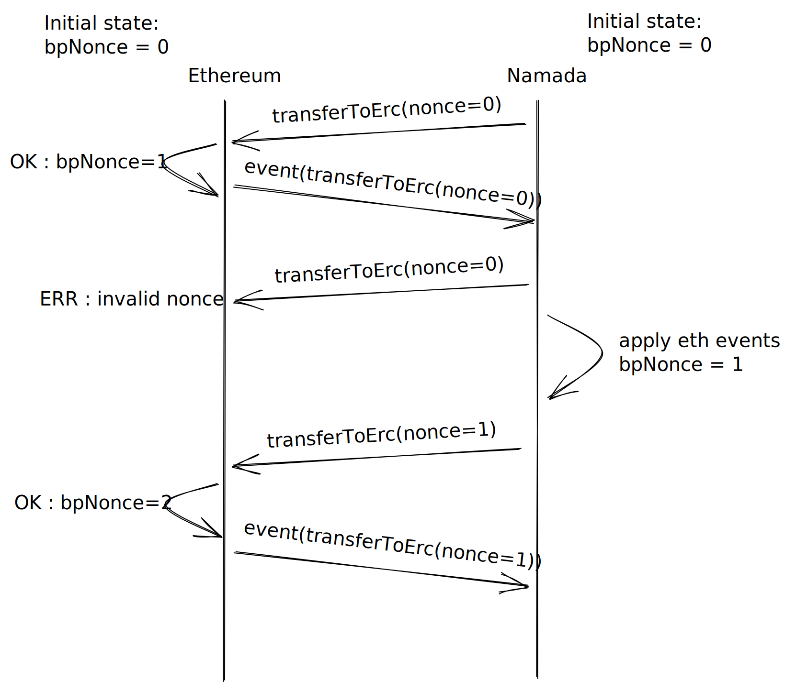

# Transferring from Namada to Ethereum

Moving assets from Namada to Ethereum will not be automatic, as opposed the
movement of value in the opposite direction. Instead, users must send an
appropriate transaction to Namada to initiate a transfer across the bridge
to Ethereum. Once this transaction is approved, the parts necessary to create
a ["proof"](proofs.md) will be created and posted on Namada. [Relayer processes]
can choose batches of pending transfers to Ethereum to be relayed.

[Relayer processes]: proofs.md#namada-bridge-relayers

It is incumbent on relayers to request an appropriate proof of existence of
such transactions. This proof must be submitted to the appropriate Ethereum smart
contract to redeem Ethereum assets / mint wrapped assets. Ethereum gas costs are
the responsibility of the end user, who should escrow NAM in `#EthBridgePool`.
After relaying a batch of pending transfers to Ethereum that make economic sense,
fees in NAM are released from `#EthBridgePool` into the relayer's address.

## Moving value to Ethereum

To redeem wrapped Ethereum assets, a user should make a transaction to escrow
their wrapped tokens in `#EthBridgePool`, which the appropriate validity predicate
will accept. For sending NAM over the bridge, a user should escrow their NAM in
`#EthBridge`. In both cases, it's important that the user also adds a
`PendingTransfer` to the [Bridge Pool](#bridge-pool-validity-predicate).
When a transfer to Ethereum event is received and acted upon in Namada,
wrapped Ethereum assets (other than wNAM) must be burned from `#EthBridgePool`.

## Batching

Ethereum gas fees make it prohibitively expensive to submit
the proof for a single transaction over the bridge. Instead, it is typically
more economical to submit proofs of many transactions in bulk. This batching
is described in this section.

A pool of transfers from Namada to Ethereum will be kept by Namada. Every
transaction to Ethereum that Namada validators approve will be added to this
pool. We call this the _Bridge Pool_.

The Bridge Pool should be thought of as a sort of mempool. When users who
wish to move assets to Ethereum submit their transactions, they will pay some
additional amount of NAM (of their choosing) as a way of covering the gas
costs on Ethereum. Namada validators will hold these fees in `#EthBridgePool`.

When a batch of transactions from the Bridge Pool is submitted by a user to
Ethereum, Namada validators will receive notifications via their full nodes.
They will then pay out the fees for each submitted transaction to the user who
relayed these transactions (still in NAM). These will be paid out from
`#EthBridgePool`.

The idea is that users will only relay transactions from the Bridge Pool
that make economic sense. This prevents DoS attacks by underpaying fees as
well as obviating the need for Ethereum gas price oracles. It also means
that transfers to Ethereum are not ordered, preventing other attack vectors.

The Bridge Pool will be organized as a Merkle tree. Every time it is updated,
the root of tree must be signed by a quorum of validators. When a user
wishes to construct a batch of transactions to relay to Ethereum, they
include the signed tree root and inclusion proofs for the subset of the pool
they are relaying. This can be easily verified by the Ethereum smart contracts.

If vote extensions are available, these are used to collect the signatures
over the Merkle tree root. If they are not, these must be submitted as protocol
transactions, introducing latency to the pool. A user wishing to relay will
need to wait until a Merkle tree root is signed for a tree that
includes all the transactions they wish to relay.

The Ethereum smart contracts won't keep track of this signed Merkle root. 
Instead, part of the proof of correct batching is submitting a root to the 
contracts that is signed by quorum of validators. Since the smart contracts 
can trust such a signed root, it can then use the root to verify inclusion 
proofs.

### Bridge Pool validity predicate

The Bridge Pool will have associated storage under the control of a native 
validity predicate. The storage layout looks as follows.

```
# all values are Borsh-serialized
/pending_transfers: Vec<PendingTransfer>
/signed_root: Signed<MerkleRoot>
```

The pending transfers are instances of the following type:
```rust
pub struct TransferToEthereum {
    /// The type of token
    pub asset: EthAddress,
    /// The recipient address
    pub recipient: EthAddress,
    /// The sender of the transfer
    pub sender: Address,
    /// The amount to be transferred
    pub amount: Amount,
}

pub struct PendingTransfer {
    /// The message to send to Ethereum to 
    /// complete the transfer
    pub transfer: TransferToEthereum,
    /// The gas fees paid by the user sending
    /// this transfer
    pub gas_fee: GasFee,
}

pub struct GasFee {
    /// The amount of gas fees (in NAM)
    /// paid by the user sending this transfer
    pub amount: Amount,
    /// The address of the account paying the fees
    pub payer: Address,
}
```
When a user initiates a transfer, their transaction should include wasm code
to craft a `PendingTransfer` and append it to the pool in storage as well as 
send the relevant gas fees into the Bridge Pool's escrow. This will be 
validated by the Bridge Pool vp. 

The signed Merkle root is only modifiable by validators. The Merkle tree 
only consists of the `TransferToEthereum` messages as Ethereum does not need 
information about the gas fees paid on Namada. 

If vote extensions are not available, this signed root may lag behind the 
list of pending transactions. However, it should be the eventually every 
pending transaction is covered by the root or it times out.

## Replay Protection

State updates in Namada, derived from transfer to Ethereum events, result in
the increment of the value of a monotonically growing nonce, that is signed
together with the root of the Bridge Pool. The `Bridge` smart contract's nonce
of transfers to Ethereum is kept in sync with Namada's, upon relay calls. This
behavior should contribute to avoiding replay attacks on Ethereum events related
to transfers to Ethereum, as it assigns a unique id on a snapshot of the Bridge
Pool. Ethereum events arriving at the ledger with a nonce different from the next
expected nonce are rejected.

## Timeouts

Pending transfers to Ethereum sitting in the Bridge Pool for some duration of
$T_{dur}$ blocks are subject to timeouts. The exact value of $T_{dur}$, for
now, is the minimum duration in blocks of an epoch. Transactions that time out
should revert the state changes in Namada, including refunding the paid fees
and escrowed assets.

Timeouts only happen after we process transfer to Ethereum events to guarantee
the consistency of the shared state between Namada and Ethereum. Nonces from
`TransferToEthereum` events will place a total order on these transfers and
any future relay attempts.

## Flow of transfers to Ethereum

This diagram demonstrates the flow of transfers from Namada to Ethereum, and
their respective failure scenarios.



Notice how the first call to `transferToErc` succeeds, but the second one
does not. This is because the event associated with the first call had
not been processed in Namada, yet. Once the event is processed, any events
which should expire will do so, but not before their derived state transitiions
are applied, if they were included in the relay operation. Finally, the nonce of
transfers to Ethereum (dubbed the `bpNonce`, in the diagram) is incremented in
Namada, allowing further relay calls to be made, as is shown.
