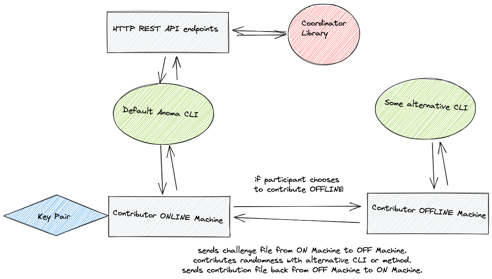
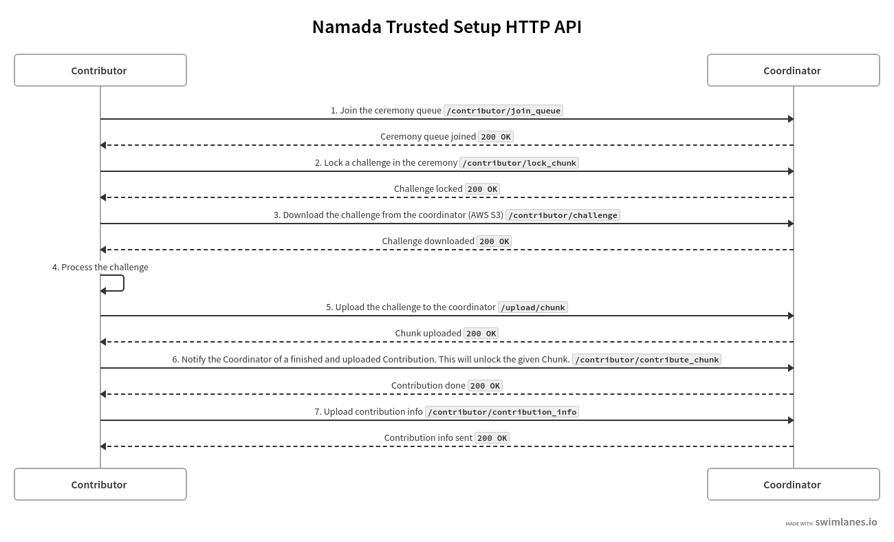

# Namada Trusted Setup
This spec assumes that you have some previous knowledge about Trusted Setup Ceremonies. If not, you might want to check the following two articles: [Setup Ceremonies - ZKProof](https://zkproof.org/2021/06/30/setup-ceremonies/) and [Parameter Generation - Zcash](https://z.cash/technology/paramgen/). 

The Namada Trusted Setup (TS) consists of running the phase 2 of the MPC which is a circuit-specific step to construct the multi-asset shielded pool circuit. Our phase 2 takes as input the Powers of Tau (phase 1) ran by Zcash that can be found [here](https://download.z.cash/downloads/powersoftau/). You can sign up for the Namada Trusted Setup [here](https://namada.net/trusted-setup.html).

## Contribution flow

### Overview

1. Contributor compiles or downloads the CLI binary and runs it.
2. CLI generates a 24-words `BIP39` mnemonic. 
3. CLI can choose to participate in the incentivized program or not.
4. CLI joins the queue and waits for its turn.
5. CLI downloads the challenge from the nearest AWS S3 bucket.
6. Contributor can choose to contribute on the same machine or another.
7. Contributor can choose to give its own seed of randomness or not.
8. CLI contributes.
9. CLI uploads the response to the challenge and notifies the coordinator with its personal info.

### Detailed Flow
**NOTE:** add CLI flag `--offline` for the contributors that run on an offline machine. The flag will skip all the steps where there is communication with the coordinator and go straight to the generation of parameters in step 14.
1. Contributor downloads the Namada CLI source from GitHub, compiles it, runs it.
2. CLI asks the Contributor a couple of questions:
		a) Do you want to participate in the incentivized trusted setup?
			- Yes. Asks for personal information: full name and email. 
			- No. Contribution will be identified as Anonymous.
3. CLI generates a `ed25519` key pair that will serve to communicate and sign requests with the HTTP REST API endpoints and receive any potential rewards.
    The private key is generated through [BIP39](https://docs.rs/tiny-bip39/latest/bip39/#) where we use it as a seed for the `ed25519` key pair and a 24 word seed-phrase is presented to the user to back-up. 
5. CLI sends request to the HTTP REST API endpoint `contributor/join_queue`. Contributor is added to the queue of the ceremony.
6. CLI polls periodically the HTTP REST API endpoint `contributor/queue_status` to get the current the position in the queue. CLI also sends periodically a heartbeat request to HTTP REST API endpoint `contributor/heartbeat` to tell the Coordinator that it is still connected. CLI shows the current position in the queue to the contributor.
7. When Contributor is in position 0 in the queue, it leaves the queue. CLI can then acquire the lock of the next chunk by sending a request to the HTTP REST API endpoint `contributor/lock_chunk`.
8. As soon as the file is locked on the Coordinator, the CLI asks for more info about the chunk through the endpoint `download/chunk`. This info is later needed to form a new contribution file and send it back to the Coordinator.
9. CLI gets the actual blob challenge file by sending a request to the endpoint `contributor/challenge`.
10. CLI saves challenge file `anoma_challenge_round_{round_number}.params` in the root folder.
11. CLI computes challenge hash.
12. CLI creates contribution file `anoma_contribution_round_{round_number}_public_key_{public_key}.params` in the root folder.
13. Previous challenge hash is appended to the contribution file.
14. Contributor decides whether to do the computation on the same machine or on a different machine.
Do you want to use another machine to run your contribution?
NOTE: be clear that if users choose to generate the parameters on a OFFLINE machine then they will have max. 15 min to do all the operations. 
- No. Participant will use the Online Machine to contribute. CLI runs `contribute_masp()` that executes the same functions as in the `contribute()` function from the `masp-mpc` crate.
    CLI asks the contributor if he wants to input a custom seed of randomness instead of using the combination of entropy and OS randomness. In both cases, he has to input something.
    CLI creates a contribution file signature `ContributionFileSignature` of the contribution.
- Yes. Participant will use an Offline Machine to contribute. CLI display a message with instructions about the challenge and contribution files. Participant can export the Contribution file `anoma_contribution_round_{round_number}_public_key_{public_key}.params` to the Offline Machine and contribute from there. When the Contributor is done, he gives the path to the contribution file. Before continuing, CLI checks if the required files are available on path and if the transformation of the parameters is valid.
NOTE: CLI will display a countdown of 10 min with an extension capability of 5 min.
14. CLI generates a json file saved locally that contains the full name, email, the public key used for the contribution, contribution hash, hash of the contribution file, contribution file signature, plus a signature of the metadata. -> display the signature and message that needs to be posted somewhere over the Internet
15.  CLI uploads the chunk to the Coordinator by using the endpoint `upload/chunk`.
16. When the contribution blob was transferred successfully to the Coordinator. CLI notifies the Coordinator that the chunk was uploaded by sending a request to endpoint `contributor/contribute_chunk`.
17. Coordinator verifies that the chunk is valid by executing function `verify_transform()` from the crate `masp-mpc`. If the transformation is correct, it outputs the hash of the contribution.
18. Coordinator calls `try_advance()` function that tries to advance to the next round as soon as all contributions are verified. If it succeeds, it removes the next contributor from the queue and adds him as contribturo to the next round. 
19. Repeat.

## Subcomponents



Our implementation of the TS consists of the following subcomponents: 
1. A fork of the [Aleo Trusted Setup](https://github.com/AleoHQ/aleo-setup/) where we re-used the Coordinator Library (CL) contained in the `phase1-coordinator` folder.
2. A [HTTP REST API](https://github.com/anoma/trusted-setup-ceremony/blob/master/phase1-coordinator/src/rest.rs) that interfaces with the CL.
3. A [CLI implementation](https://github.com/anoma/trusted-setup-ceremony/tree/master/phase1-cli) that communicates with the HTTP REST API endpoints.
4. An integration of the [`masp-mpc`](https://github.com/heliaxdev/masp-mpc) crypto functions (`initialize`, `contribute` and `verify`) in the CL.

Let's go through each subcomponents and describe them.

## 1. Coordinator Library (CL)
### Description
The CL handles the operation steps of the ceremony: adding a new contributor to the queue, authentificating a contributor, sending and receiving challenge files, removing inactive contributors, reattributing challenge file to a new contributor after a contributor dropped, verifying contributions, creating new files...

### "Historical" context
The CL was originally implemented for the Powers of Tau (phase 1 of the MPC). In this implementation, there was a tentative to optimise the whole operational complexity of the ceremony. In short, to reduce the contribution time to the parameters, the idea was to split the parameters during a round into multiple chunks that can be then distributed to multiple participants in parallel. That way, the computation time would be reduced by some linear factor on a per-round basis. You can read more about it [in this article](https://zkproof.org/2021/06/30/setup-ceremonies/ ).

### CL in the Namada context
Splitting the parameters into multiple chunks is useful, if it takes hours to contribute. In our case, the contribution time is about some seconds and in the worst case about some minutes. So, we don't need to split the parameters into chunks. Though, since we forked from the Aleo Trusted Setup, we still have some references to "chunked" things like folder, variable or function names. In our implementation, this means that we have one contributor and one chunk per round. For example, the contribution file of a round `i` from a participant will always be located at `transcript/round_{i}/chunk_0/contribution_1.unverified`. 
To be able to re-use the CL without heavy refactoring, we decided to keep most of the Aleo code as it is and only change the parts that needed to be changed, more precisely the crypto functions (`initialize`, `contribute` and `verify`) and the coordinator config `environment.rs`.

## 2. HTTP REST API
### Description
The [HTTP REST API](https://github.com/anoma/namada-trusted-setup/blob/main/phase1-coordinator/src/rest.rs) is a rocket web server that interfaces with the CL. All requests need to be signed to be accepted by the endpoints. It's the core of the ceremony where the Coordinator is started together with utility functions like `verify_contributions`  and `update_coordinator`.

### Endpoints
- `/contributor/join_queue` Add the incoming contributor to the queue of contributors. 
- `/contributor/lock_chunk` Lock a Chunk in the ceremony. This should be the first function called when attempting to contribute to a chunk. Once the chunk is locked, it is ready to be downloaded.
- `/contributor/challenge` Get the challenge key on Amazon S3 from the Coordinator.
- `/upload/chunk` Request the urls where to upload a Chunk contribution and the ContributionFileSignature.
- `/contributor/contribute_chunk` Notify the Coordinator of a finished and uploaded Contribution. This will unlock the given Chunk.
- `/contributor/heartbeat` Let the Coordinator know that the participant is still alive and participating (or waiting to participate) in the ceremony.
- `/update` Update the Coordinator state. This endpoint is accessible only by the coordinator itself.
- `/stop` Stop the Coordinator and shuts the server down. This endpoint is accessible only by the coordinator itself.
- `/verify` Verify all the pending contributions. This endpoint is accessible only by the coordinator itself.
- `/contributor/queue_status` Get the queue status of the contributor.
- `/contributor/contribution_info` Write ContributionInfo to disk.
- `/contribution_info` Retrieve the contributions' info. This endpoint is accessible by anyone and does not require a signed request.
- `/healthcheck` Retrieve healthcheck info. This endpoint is accessible by anyone and does not require a signed request.



### Saved files
- `contributors/namada_contributor_info_round_{i}.json` contributor info received from the participant. Same file as described below. 
- `contributors.json` list of contributors that can be exposed to a public API to be displayed on the website
```json
[
   {
      "public_key":"very random public key",
      "is_another_machine":true,
      "is_own_seed_of_randomness":true,
      "ceremony_round":1,
      "contribution_hash":"some hash",
      "contribution_hash_signature":"some hash",
	// (optional) some timestamps that can be used to calculate and display the contribution time
      "timestamp":{
         "start_contribution":1,
         "end_contribution":7
      }
   },
   // ...
   {
      "public_key":"very random public key",
      "is_another_machine":true,
      "is_own_seed_of_randomness":true,
      "ceremony_round":42,
      "contribution_hash":"some hash",
      "contribution_hash_signature":"some hash",
      "timestamp":{
         "start_contribution":1,
         "end_contribution":7
      }
   }
]
```

## 3. CLI Implementation
### Description
The CLI communicates with the HTTP REST API accordingly to the [overview of the contribution flow](#overview-of-the-contribution-flow).

### Saved files 
- `namada_challenge_round_{round_number}.params` challenge file downloaded from the Coordinator.
- `namada_contribution_round_{round_number}.params` contribution file that needs to be uploaded to the Coordinator
- `namada_contributor_info_round_{round_number}.json` contributor info that serves to identify participants.
```json
{
   "full_name":"John Cage",
   "email":"john@cage.me",
   // ed25519 public key
   "public_key":"very random public key",
   // User participates in incentivized program or not
   "is_incentivized":true,
   // User can choose to contribute on another machine
   "is_another_machine":true,
   // User can choose the default method to generate randomness or his own.
   "is_own_seed_of_randomness":true,
   "ceremony_round":42,
   // hash of the contribution run by masp-mpc, contained in the transcript
   "contribution_hash":"some hash",
   // FIXME: is this necessary? so other user can check the contribution hash against the public key?
   "contribution_hash_signature":"signature of the contribution hash",
   // hash of the file saved on disk and sent to the coordinator
   "contribution_file_hash":"some hash",
   "contribution_file_signature":"signature of the contribution file",
   // Some timestamps to get performance metrics of the ceremony
   "timestamp":{
		// User starts the CLI
      "start_contribution":1,
      // User has joined the queue
      "joined_queue":2,
      // User has locked the challenge on the coordinator
      "challenge_locked":3,
      // User has completed the download of the challenge
      "challenge_downloaded":4,
      // User starts computation locally or downloads the file to another machine
      "start_computation":5,
      // User finishes computation locally or uploads the file from another machine
      "end_computation":6,
      // User attests that the file was uploaded correctly
      "end_contribution":7
   },
   "contributor_info_signature":"signature of the above fields and data"
}
```

## 4. Integration of the `masp-mpc` 
### Description
There are 4 crypto commands available in the CL under `phase1-coordinator/src/commands/`: 
1. `aggregations.rs` this was originally used to aggregate the chunks of the parameters. Since we don't have chunks, we don't need to aggregate anything. However, this logic was required and kept to transition between rounds. It doesn't affect any contribution file.
2. `computation.rs`  is used by a participant to contribute. The function `contribute_masp()` contains the logic from `masp-mpc/src/bin/contribute.rs`.
3. `initialization.rs`  is used to bootstrap the parameters on round 0 by giving as input the [Zcash's Powers of Tau](https://download.z.cash/downloads/powersoftau/). The function `initialize_masp()` contains the logic from `masp-mpc/src/bin/new.rs`.
4.  `verification.rs` is used to verify the correct transformation of the parameters between contributions. The function `verify_masp()` contains the logic from `masp-mpc/src/bin/verify_transform.rs`.
