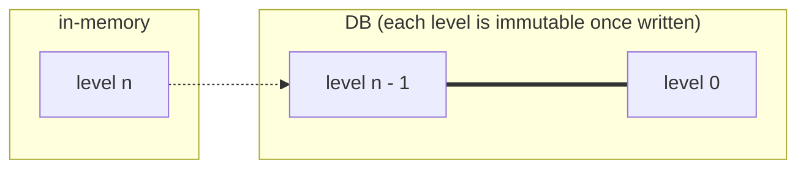
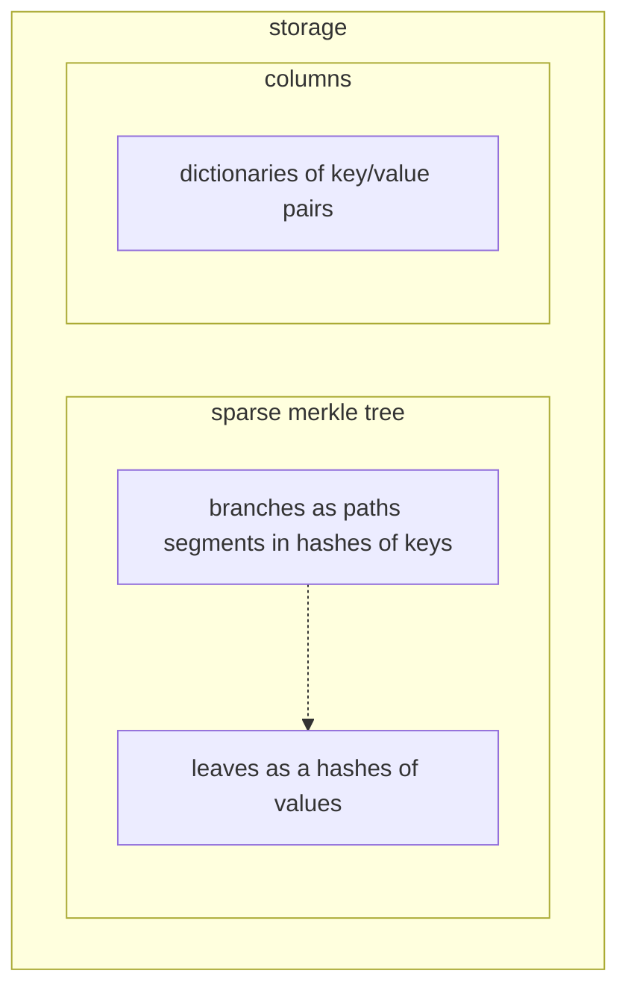

# Database

We can make use of the Tendermint's finality property to split the storage into immutable and mutable parts, where only the data at the current level is mutable. It should be possible to have the mutable state in-memory only and write to DB only once a block is finalized, which combined with batch writes would most likely be quite efficient (this can also be done asynchronously).

## In-memory (mutable state)

The current state is stored in a Sparse Merkle tree. The layout of data in memory should be flexible to allow to optimize throughput. For example, the values of key/value pairs may better stored in a sequence outside of the tree structure. Furthermore, it maybe be better to have the data sorted in memory. This may be possible by decoupling the merkle tree structure from the data and the key/value pairs, as illustrated below.

It may be advantageous if the data columns keys are not hashed to preserve ordering.

## DB (immutable state)

The immutable state doesn't have the same requirements as the mutable. This means that a different data structures or memory layout may perform better (subject to benchmarks). The state trees in the immutable blocks should take advantage of its properties for optimization. For example, it can save storage space by sharing common data and/or delta compression. 

It's very likely that different settings for immutable storage will be provided in future, similar to e.g. [Tezos history modes](https://tezos.gitlab.io/user/history_modes.html).

## Benchmarks

We'd like to have easily reproducible benchmarks for the whole database integration that should be filled over time with pre-generated realistic data. This should enable us to tune and compare different hashing functions, backends, data structures, memory layouts, etc.

### Criteria
- in-memory
  - writes (insert, update, delete)
    - possibly also concurrent writes, pending on the approach taken for concurrent transaction execution
  - reads
  - proof generation (inclusion, non-inclusion)
- DB (lower priority)
  - writes in batched mode
  - reads
  - proof generation (inclusion, non-inclusion)

## DB backends

The considered options for a DB backend are given in [Libraries & Tools / Database page](/explore/libraries/db.md).

### RocksDB

In terms of RocksDB, the mutable part would be the Active memtable. When committed, it would switch to ReadOnly memtable, which is then flushed to disk and compacted.
