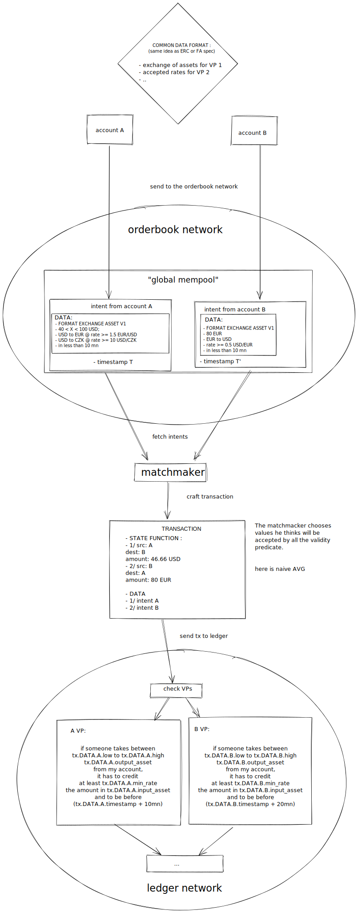
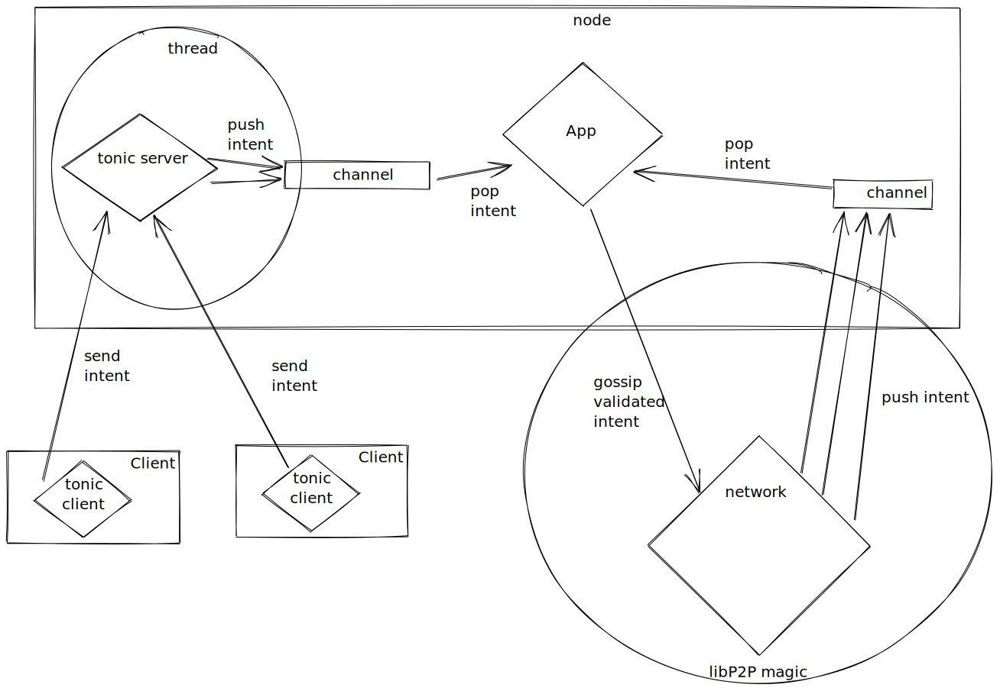

# The gossip/orderbook

## High level Overview

The orderbook network runs in parallel to the ledger network. It purpose is to
gossip any expression of intents that can be picked up by a matchmaker in order
to create valid transaction.

## Orderbook process

