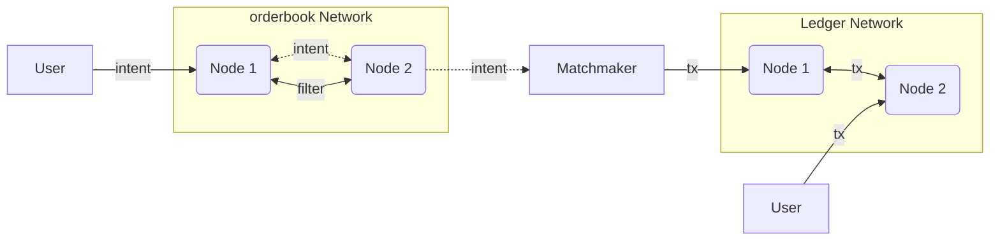
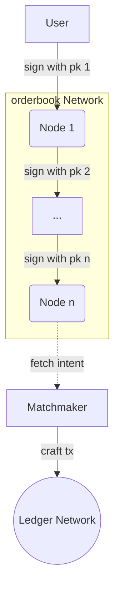

# The gossip/orderbook

## High level Overview

The orderbook network is parallel to the ledger network, they are bridge
together by a matchmaker process.

## Incentive

Each orderbook must have an incentive to propagate intent and matchmaker to
craft transactions. The transaction contains public key of participant orderbook
and the matchmaker who crafted it.

Incentive function TBD.

