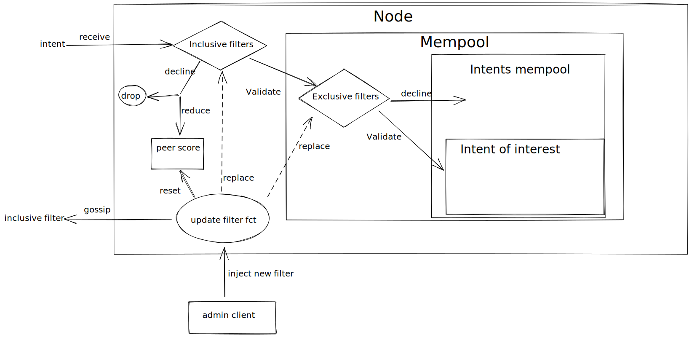

# Orderbook filter

The orderbook checks intent on arrival and periodically with two differents
 filters:

- An inclusive filter, low on computation and gossiped to all others peers. This
  filter allow for a quick validation to check the interest of a node.

- An exclusive filter, can be high on computation and is only run locally on the
  node. This filter might do more detailed check but can't be gossiped.

If a peer does not respect the inclusive filter, it score is lowered until a
thresold that ban it for some time.

When the inclusive filter is updated it must be gossiped to other peers and the
peers score is reseted.

Each orderbook can parametrize how often the intents must be checked out,
balancing the computation cost of validating and gossiping intent that wont be
matched.

