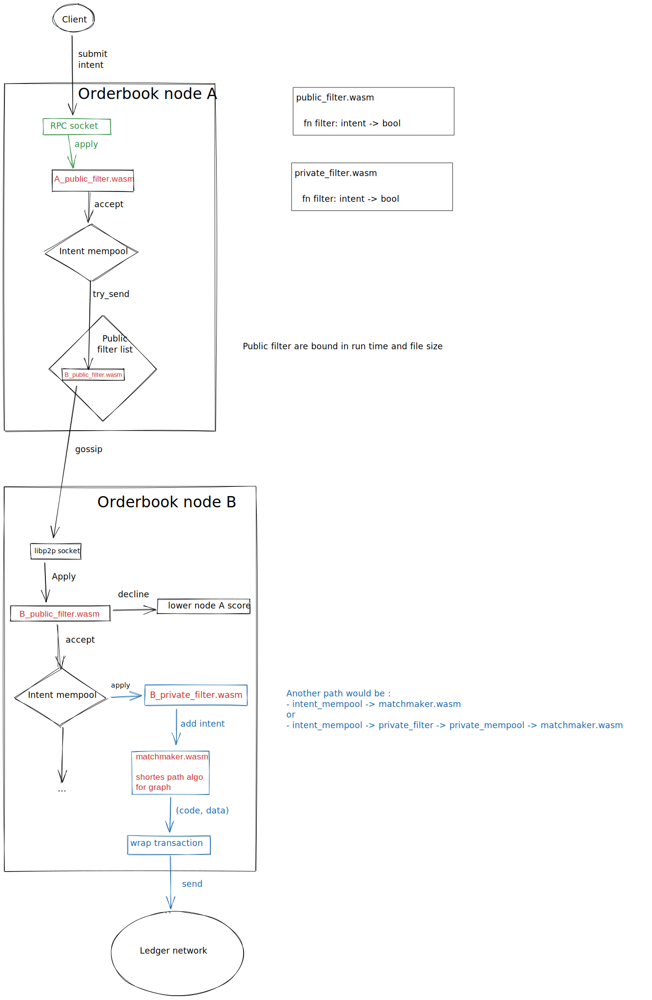

# Intents

tracking issue [#36](https://github.com/heliaxdev/rd-pm/issues/36)

TODO describe type, life cycle

## Intent :

There is only a single intent type.

The intent allows arbitrary data that must be used by the matchmaker to craft
transaction. Some arbitrary field might be exported to specific field, like
`timestamp`, when they are mainstream.

```rust
struct Intent {
    data: Vec<u8>,
    timestamp: Timestamp
}
```

## Intent life cycle


