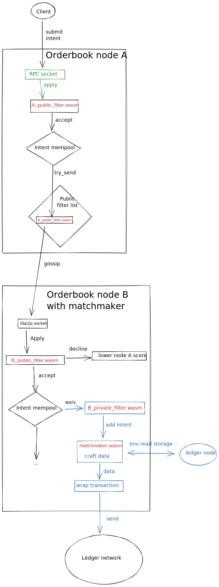

# Intent broadcaster

## High level Overview

The intent broadcaster use the gossip network to propagates intents. An intent
describe the desire of a user, from asset exchange to a green tax percent for
selling shoes. Theses intents are picked up by a matchmaker that composed them
into a valid transaction to send to the ledger network. A matchmaker is
optionnaly included in the intent broadcaster node.

the intent broadcaster network must propagate a large number of intent quickly.
In order to scale and reduce the number of propagation, the network is split
into multiple sub network. Each subnetwork is define by a topic and each node
can connect to as many topic as desired.

### example of process

[exilidraw
link](https://excalidraw.com/#room=257e44f4b4b5867bf541,XDEKyGVIpqCrfq55bRqKug)

# Complete life cycle of an intent

[exilidraw link](https://excalidraw.com/#room=7ac107b3757c64049003,cdMInfvdLtjaGWSZWEKrhw)
