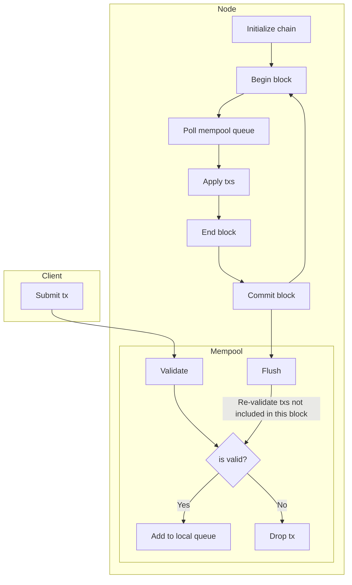
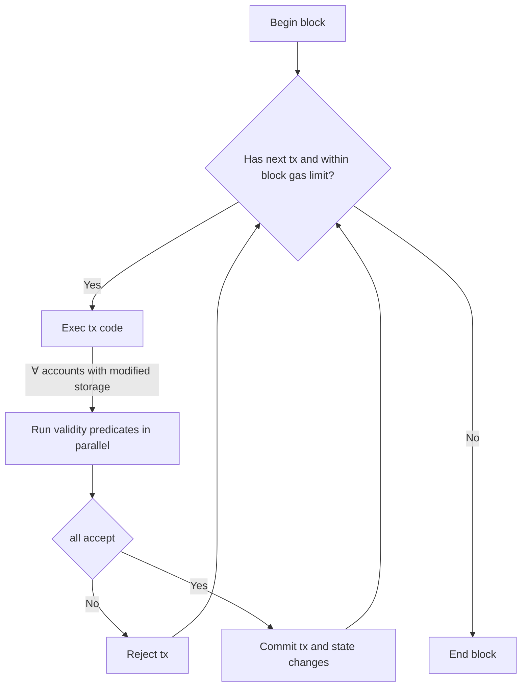

# Transaction execution

[Tracking Issue](https://github.com/anomanetwork/anoma/issues/43)

---

## Implementation overview (verbatim from the paper section 1.1)

The aforementioned abstract trade system is instantiated using a validity predicate (VP) account model. Like a distributed virtual machine such as the EVM, the ledger contains many independent accounts with their own state subspace and code. Unlike a distributed virtual machine, execution does not proceed in a step-by-step flow where contracts initiate message calls to other contracts. Instead, transactions execute arbitrary code, read and write state as they please, and then all accounts whose state was al- tered in the course of the transaction decide whether to accept or reject it. The code associated with an account is referred to as a validity predicate, and the validity predicate can also be changed in a transaction (the change being validated by the old validity predicate before being enacted).

In order, a transaction is executed as follows:
1. Arbitrary code is executed in a virtual machine (LLVM/WASM) which can read/write all public state.
    1. The ledger tracks which accounts state was read or written.
    2. The ledger keeps writes in a temporary cache and does not yet commit them.
    3. Separate transactions are parallelized based on the read/write graph with a multi-version concurrency control approach similar to that used in PostgreSQL.
2. All accounts whose state was written during the code execution have the opportunity to accept or reject the transaction.
    1. The accounts validity predicate is called with access to all state changes which occurred and any extra data in the transaction (e.g. proofs).
    2. This validity predicate check is stateless and thus can happen in parallel for any number of involved accounts.
3. The state changes are committed if and only if all involved accounts accept the transaction.

For our purpose of multi-party exchange, this model has several advantages over step-based execution and contract-originating message calls:
- No coordinating contract is required to handle multi-party exchange, and accounts involved in multi-party exchange do not necessarily need to know about each other’s existence. Generally speaking, ac- counts accept transactions as long as certain invariants (e.g. ownership and preservation of supply for a token) are preserved.
- Transaction execution can be much more efficient, since state changes can be directly specified (instead of computed) and only validated by the involved accounts, which can be done in parallel. The possibility of code execution during the first phase allows for limited computation in the case of possibly contentious shared resources (e.g. a counter being incremented).

## Transaction (tx) data

There is only a single transaction type:

```rust
struct Transaction {
    // A wasm module with a required entrypoint
    code: Vec<u8>
    // Optional arbitrary data
    data: Option<Vec<u8>>,
    // A timestamp of when the transaction was created
    timestamp: Timestamp,
    gas_limit: TODO,
}
```

The tx allows to include arbitrary `data`, e.g zero-knowledge proofs and/or arbitrary nonce bytes to obfuscate the tx's minimum encoded size that may be used to derive some information about the tx.

TODO once we have DKG, we will probably want to have some kind of a wrapper transaction with submission fees, payer and signature

## Tx life cycle



New txs are injected by the client via mempool. Before including a tx in a local mempool queue, some cheap validation may be performed. Once a tx is included in a mempool queue, it will be gossiped with the peers and may be included in a block by the block proposer. Any txs that are left in the queue after flush will be subject to re-validation before being included again.

The order of applying transactions within a block is fixed by the block proposer in [the front-running prevention protocol](/explore/design/ledger/front-running.md).

TODO we might want to randomize the tx order after DKG protocol is completed

### Block application

Within a block, each tx is applied sequentially in three steps:



## Tx code

The code is allowed to read and write anything from [accounts' sub-spaces](./accounts.md#dynamic-storage-sub-space) and to [initialize new accounts](./accounts.md#initializing-a-new-account). Other data that is not in an account's subspace is read-only, e.g. chain and block metadata, account addresses and potentially keys.

In addition to the verifiers specified in a transaction, each account whose sub-space has been modified by the tx triggers its VP. The VPs are then given the prior and posterior state from the account's sub-space together with the tx to decide if it accepts the tx's state modifications.

Within a single tx the execution of the validity predicates will be parallelized and thus the fee for VPs execution would their maximum value (plus some portion of the fees for each of the other parallelized VPs - nothing should be "free"). Once any of the VPs rejects the modifications, execution is aborted, the transaction is rejected and state changes discarded. If all the VPs accept the modifications, the transaction is successful and modifications are committed to storage as the input of the next tx.

The transaction's API should make it possible to transfer tokens to a hash of a public key that is not revealed. This could be done by having a "deposit" account from which the key's owner can claim the deposited funds.

Should some type of token prefer not to allow to receive tokens without recipient's approval, a token account can implement logic to decline the received tokens.

