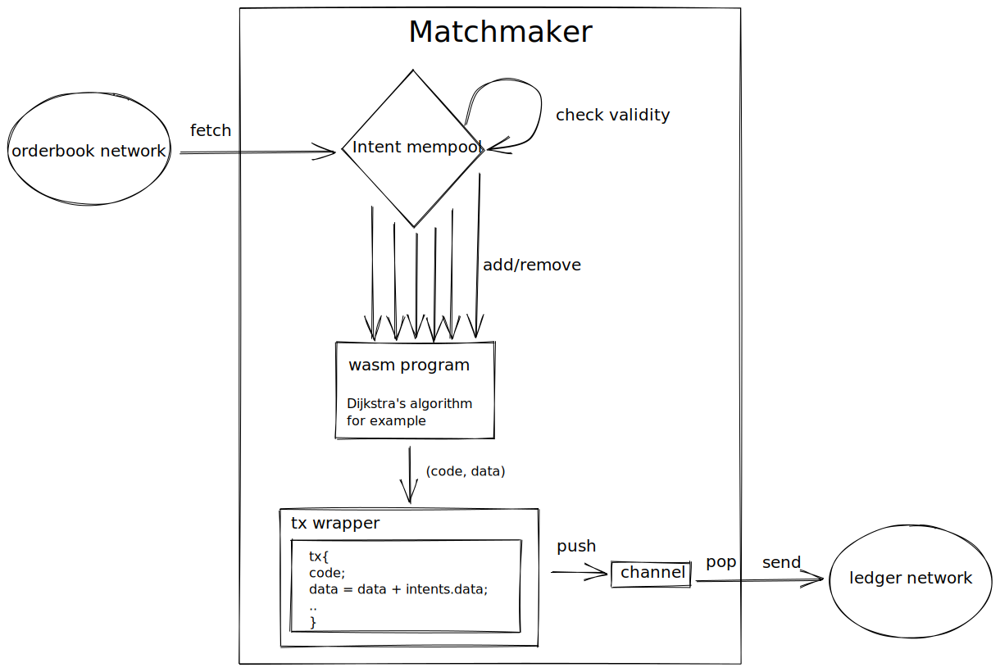

# matchmaker

The matchmaker has the task to craft transaction based on intent and inject them
into the ledger.

A wasm program wasm must be attached to any matchmaker with some specific
entrypoint (TDB). This program is feed with intents data and craft transaction.
The matchmaker should include a payement for himself in the transaction to
reembourse himself of the fee he had to pay.

## process

