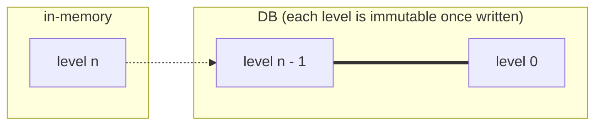
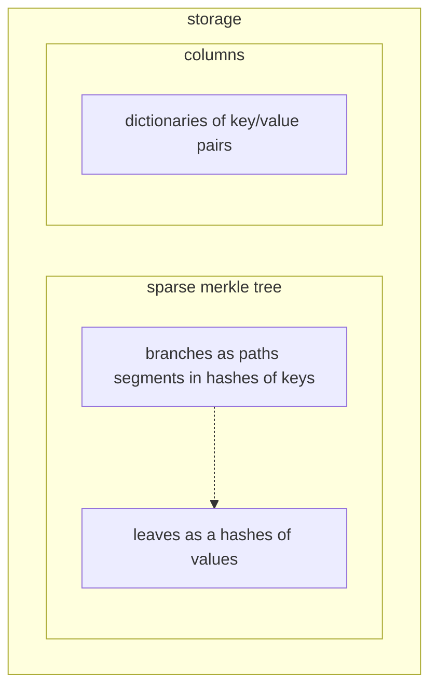

# Storage

We can make use of the Tendermint's finality property to split the storage into immutable and mutable parts, where only the data at the current level is mutable. It should be possible to have the mutable state in-memory only and write to DB only once a block is finalized, which combined with batch writes would most likely be quite efficient (this can also be done asynchronously).



## In-memory (mutable state)

The current state is stored in a Sparse Merkle tree. The layout of data in memory should be flexible to allow to optimize throughput. For example, the values of key/value pairs may better stored in a sequence outside of the tree structure. Furthermore, it maybe be better to have the data sorted in memory. This may be possible by decoupling the merkle tree structure from the data and the key/value pairs, as illustrated below.



It may be advantageous if the data columns keys are not hashed to preserve ordering.

## DB (immutable state)

The immutable state doesn't have the same requirements as the mutable. This means that a different data structures or memory layout may perform better (subject to benchmarks). The state trees in the immutable blocks should take advantage of its properties for optimization. For example, it can save storage space by sharing common data and/or delta compression. 

It's very likely that different settings for immutable storage will be provided in future, similar to e.g. [Tezos history modes](https://tezos.gitlab.io/user/history_modes.html).

## Benchmarks

We'd like to have easily reproducible benchmarks for the whole database integration that should be filled over time with pre-generated realistic data. This should enable us to tune and compare different hashing functions, backends, data structures, memory layouts, etc.

### Criteria
- in-memory
  - writes (insert, update, delete)
    - possibly also concurrent writes, pending on the approach taken for concurrent transaction execution
  - reads
  - proof generation (inclusion, non-inclusion)
- DB (lower priority)
  - writes in batched mode
  - reads
  - proof generation (inclusion, non-inclusion)

## DB backends

The considered options for a DB backend are given in [Libraries & Tools / Database page](/explore/libraries/db.md).

### RocksDB

A committed block is not immediately persisted on RocksDB. When the block is committed, a set of key-value pairs which compose the block is written to the memtable on RocksDB. For the efficient sequential write, a flush is executed to persist the data on the memtable to the disk as a file when the size of the memtable is getting big (the threshold is one of the tuning parameters).

We can disable write-ahead log(WAL) which protects these data on the memtable from a crash by persisting the write logs to the disk. Disabling WAL helps reduce the write amplification. That's because WAL isn't required for Anoma because other nodes have the block. The blocks which have not been persisted to the disk by flush can be recovered even if an Anoma node crashes.

## Implementation

### `storage` module

This is the main interface for interacting with storage in Anoma.

This module and its sub-modules should implement the in-memory storage (and/or a cache layer) with Merkle tree (however, the interface should be agnostic to the choice of vector commitment scheme or whether or not there even is one, we may want non-Merklised storage) and the persistent DB.

The in-memory storage holds chain's metadata and current block's storage.

Its public API should allow/provide:
- get the Merkle root and Merkle tree proofs
- read-only storage API for ledger's metadata to be accessible for transactions' code, VPs and the RPC
  - with public types of all the stored metadata
- unless specified otherwise, read the state from the current block

An API made visible only to the shell module (e.g. `pub ( in SimplePath )` - https://doc.rust-lang.org/reference/visibility-and-privacy.html) should allow the shell to:
- load state from DB for latest persisted block or initialize a new storage if none found
- begin a new block
- within a block:
  - transaction can modify [account sub-space](/explore/design/ledger/accounts.md#dynamic-storage-sub-space)
    - the function that modify storage (e.g. `write` and `delete`) have to guarantee to also update the Merkle tree
  - store each applied transaction and its result
- end the current block
- commit the current block (persist to storage)

### `storage/db` module

The persistent DB implementation (e.g. RocksDB).

### DB keys

The DB keys are composed of key segments. A key segment can be an `Address` which starts with `#` (there can be multiple addresses involved in a key) or any user defined non-empty utf-8 string (maybe limited to only alphanumerical characters). Also, `/` and `?` are reserved. `/` is used as a separator for segments. `?` is reserved for a validity predicate and the key segment `?` can be specified only by the specific API.

In the DB storage, the keys would be prefixed by the block height and the space type. This would be hidden from the wasm environment, which only operates at the current block height. For example, when the block height is `123` and the key specified by the storage is `#my_address_hash/balance/token`, the actual key for the persistent DB implementation would be `123/subspace/#my_address_hash/balance/token`.

This could roughly be implemented as:

```
struct Key {
    segments: Vec<DbKeySeg>
}

impl Key {
    fn parse(string: String) -> Result<Self, Error> {..}
    fn push(&self, other: &KeySeg) -> Self {..}
    fn join(&self, other: &Key) -> Self {..}
    fn into_string(&self) -> String;
    // find addresses included in the key, used to find which validity-predicates should be triggered by a key space change
    fn find_addresses(&self) -> Vec<Address> {..}
}

// Provide a trait so that we can define new pre-defined key segment types inside wasm environment and also ad-hoc key segments defined by wasm users
trait KeySeg {
    fn parse(string: String) -> Result<Self, Error>;
    fn to_string(&self) -> String;
    fn to_db_key(&self) -> DbKeySeg;
}

enum DbKeySeg {
    AddressSeg(Address),
    StringSeg(String),
}

impl KeySeg for DbKeySeg {..}
impl KeySeg for BlockHeight {..}
```

Then the storage API functions (read/write/delete) should only accept the keys with this `Key` type.
